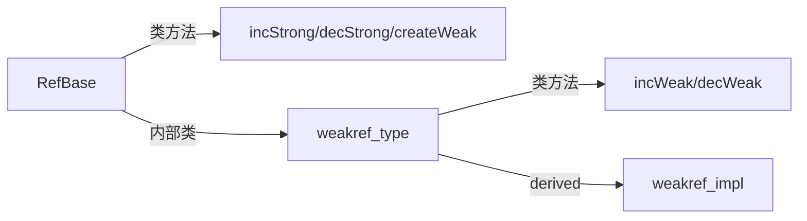

# 头文件 声明

### cpp需要声明

为什么 C++ 需要声明

- 需要知道函数的参数和返回值类型：
- 需要支持重载，
- 需要支持隐式类型转换
- ...

上下文的重要性：C++ 是一种强烈依赖上下文信息的编程语言

```cpp
// 声明了 void show(float x)，
// 那么编译器知道把 3 转换成 3.0f 才能调用
// 并且 hello 不是 变量或者类的名字：
show(3);

// 如果编译器不知道 vector 是个模板类, 看作是变量名
// 把 < 解释为小于号，从而理解成判断‘vector’这个变量的值是否小于‘MyClass’这个变量的值。
vector < MyClass > a;

// T 是不确定的, 编译器无法确定 decay<T> 的 type 是 类型，还是 值
decay<T>::type;
// 用 typename 修饰来让编译器确信这是一个类型名
typename decay<T>::type;
```


### 头文件

#### 只写一遍

为了使用 hello 这个函数，我们刚才在 main.cpp 里声明了 void hello() 。

如果另一个文件 other.cpp 也需要用 hello 这个函数呢？

1. 再在cpp文件中声明一遍？

2. 还是使用头文件：只写一遍，然后自动插入到需要用 hello 的那些 .cpp 里。

   - 既然每个 .cpp 文件的这个部分是一模一样的，

     不如把 hello() 的声明放到单独一个文件 hello.h 里，

   - 在需要用到 hello() 这个声明的地方，打上记号，`#include "hello.h`


#### 预处理阶段

把 .h 文件插入cpp，这样就只用编辑 hello.h 一次了。

- 用一个小程序，自动在编译前把引号内的文件名 hello.h 的内容插入到记号所在的位置，

- 后来，这个编译前替换的步骤逐渐变成编译器的了一部分，称为预处理阶段，
- #define 定义的宏也是这个阶段处理的。


#### .cpp中声明.h文件

在实现的文件 hello.cpp 中导入声明的文件 hello.h 是个好习惯，

- 节省复制粘贴以及对应的维护：类的声明，函数的声明。

  在 C++ 中常常用到很多的类，函数 的声明都应该被放到头文件中。

- 同一cpp中的函数需要相互引用时，不需要关心定义的顺序。

- 声明本身就可以避免“沉默的错误”

  - 保证当 hello.cpp 被修改时，比如改成 hello(int)，

    编译器能够发现 hello.h 声明的 hello() 和定义的 hello(int) 不一样，避免“沉默的错误”。

  - （虽然可能对支持重载的 C++ 不奏效）


### 导入

导入顺序

- `<cstdio> `

  - 不在当前目录下搜索，

  - 只在系统目录里搜索，

- `”hello.h” `

  - 优先搜索当前目录
  - 如果没有，再搜索系统目录。

递归

有时候我们的函数声明需要使用到某些类，就需要用到声明了该类的头文件，像这样递归地 #include 即可：

- 但是这样造成一个问题，就是如果多个头文件都引用了 MyClass.h，那么 MyClass 会被重复定义两遍：
- 解决方案：
  - 在头文件前面加上一行：#pragma once
   - 当预处理器第二次读到同一个文件时，就会自动跳过通常头文件都不想被重复导入，
  - 因此建议在每个头文件前加上这句话


# 安全初始化

### 避免未初始化

在栈上定义一个POD类型，不会初始化其值，而是内存中的垃圾值。这一错误尤其隐蔽。

- gcc确实会默认对变量进行初始化，
- 但这种完全依赖编译器的做法很可能导致读到随机数。

由于auto必须初始化，从而保证了所有变量一定会被初始化。符合这种不初始化就报错的思想，因此诞生了以下的做法：

- auto-idiom：所有栈上变量类型必须声明为auto，让他根据等号右边的值类型自动推导。

- lambda-idiom：大大提升了变量初始化需要复杂控制语句时的灵活性；


对于new指针来说，智能指针：

- 进一步避免new可能存在的未初始化问题；
- 虽然new的内存在堆上，但是作为返回值的指针本身在栈上。

> 对于指针 使用majeunique 或shared而不是new。一定会调用构造函数进行初始化(甚至gcc可以使用初始化列表。 没有犯错的土壤。auto x = new mclass无括号，会导致未初始化。


另外，下文会介绍涉及到的一些现代C++语法糖，如

- C++11的结构体成员自带默认值
- C++20的designated-initialization语法等。


#### auto-idiom

auto-idiom，可以使用强制类型转换避免错误推导。

```cpp
// 自动推导为 int
auto mInt = 1;

// 自动推导为 double, 值为 6.00
auto mInt2 = mInt ? 3.00 : 6; // 需要保证:两边类型一致，auto会做类型提升
cout << "mInt2 = " << mInt2 << ", type = " << typeid(mInt2).name() <<endl;

// 避免错误推导 - 强制类型转换
auto mInt = int(3);
// 避免错误推导 - 强制类型转换 static_cast
auto mInt = static_cast<size_t>(3);

// 同理, 其它类型也可以使用 auto-idiom
auto mch  = '0';
auto mch2 = char(0);
auto mStruct2 = Demo_strcut{};
```


#### lambda-idiom

灵活性：lambda可以写复杂的逻辑。大大提升了变量初始化需要复杂控制语句时的灵活性；

不需要指定返回值类型：lambda的返回值一定是auto，显式写往往是为了强制类型转换或者便于阅读。

```cpp
// 自动推导返回值类型
auto mInt_rc = [&] {
	if (argc) {
        return atoi(argv[0]);
    } else {
        return 2;
    }
} (); // 注意这里调用了 operator()()，获得的是返回值而不是 lambda

// 显示指定返回值类型 int
auto mInt_rc = [&] -> int {
	// ...
    return 1.0;
} (); //...
```


#### 智能指针

```cpp
struct Demo_strcut {
    int a;
    int b;
};

int main() {
    // auto-idiom
    auto mStruct = Demo_strcut;   // 错误，编译失败
    auto mStruct2 = Demo_strcut{}; // 正确
    // 智能指针
    auto mStruct3 = std::make_unique<Demo_strcut>(); // 正确
    
    return 0;
}
```


### 类型

对于各个类型，更特殊的去讲。

#### 数据类型

对于数据类型来说，为了即使用auto又避免错误推导，可以有三种做法：

- 直接 强制类型转换
- `static_cast<T>(val)`
- UINT系列宏（不常用）

```cpp
// 对size_t等数据类型，会出现auto错误推导的情况
// size_t一般是int64，使用场景之一是 能满足超大idx的需求。

auto mVec = std::vector<char>(0x1ff);
// 使用强制类型转换
for (auto i = size_t(0); i < mVec.size; i++) {
    // do something
}
// 使用static_cast，(类型安全)
for (auto i = static_cast<size_t>(0); i < mVec.size; i++) {
    // do something
}
// 使用宏，(不推荐)
for (auto i = UINT64(0); i < mVec.size; i++) {
    // do something
}
```


##### auto + 强制类型转换

自动推导存在错误，无法使用方便的string提供的一系列运算符重载

解决方案：

- 强制类型转换
- 自定义字面量后缀
  - cpp14定义了`basic_string`的 `operater""s重载`。
  - 需要 `using namespace std::literals`

```cpp
// 自动推导类型为char*
auto s = "hello"; // 不符合string的预期
```

```cpp
// 强制类型转换
auto s =string("hello");

// 自定义字面量后缀 - 字面量
// 玩个骚的，字面量
//  - 需要 using namespace std
//  - 精确一点 using namespace std::literals
//  - 更精确一些 using namespace std::string_litera
//    因为其它库也存在字面量 例如 chrono  1min 1y 1d ...都是字面量
auto s = "hello" s;
```


#### struct

##### 初始化

###### 成员类型一致

```cpp
struct Demo_strcut {
    int a;
    int b;
};
```

可以使用如下写法。

```cpp
int main() {
    // auto-idiom
    auto mStruct = Demo_strcut;   // 错误，编译失败
    auto mStruct2 = Demo_strcut{}; // 正确
    auto mStruct2{Demo_strcut{1, 2}}; // 正确，更安全
    auto mStruct2 = Demo_strcut{1, 2}; // 这里正确, 但可能被误认为是std::initializer_list<>
    // 智能指针
    auto mStruct3 = std::make_unique<Demo_strcut>(1, 2); // 正确
    
    return 0;
}
```

###### 不一致

struct 成员类型不一致，需要换一种写法。

> 因为，例如使用 `Demo_strcut{1, "a"}`，会被误认为是`std::initializer_list<>`

```cpp
struct Demo_strcut {
    int a = 0;
    std::string b = "e"s;
};

int main() {
    // auto-idiom
    auto mStruct = Demo_strcut;   // 错误，编译失败
    auto mStruct2 = Demo_strcut{}; // 正确
    auto mStruct4{Demo_strcut{1, "a"}}; // 正确，更安全
    auto mStruct3 = Demo_strcut{1, "a"}; // 错误,被误认为是`std::initializer_list<int>`

    return 0;
}
```


##### 指定初始化

cpp20开始，指定初始化。struct 指定部分成员 的值，进行初始化。

```cpp
struct Demo_strcut {
    int sex = 0;
    int age = 25;
    std::string name = "auguste"s;
};

int main() {
    // auto-idiom
    auto mMe = Demo_strcut{.age = 1};
    
	return 0;
}
```


# RAII

## 概念

Resource Acquisition Is Initialization

- 资源获取视为初始化，

- 资源释放视为销毁

### 资源销毁

**避免犯错误**

C++ 的解构函数（destructor）是显式的，与 Java，Python 等垃圾回收语言不同。

- 可以显式调用：

> 通过`malloc free`，`new delete` 和 `new[] delete[]`手动创建释放

- 或**离开作用域自动销毁**

> 在使用上，我们希望 离开 `{}`作用域自动释放
>
> 有好处也有坏处，对高性能计算而言利大于弊

如果没有解构函数，则每个带有返回的分支都要手动释放所有之前的资源:

> 如果用 new/delete 或者 malloc/free 就很容易出现忘记释放内存的情况，造成内存泄露。
>
> 而 vector 会在离开作用域时，自动调用解构函数，释放内存，就不必手动释放了，更安全。

```cpp
#include <vector>
#include <iostream>

int main() {
    std::vector<int> v(4, 0);
    int sum = 0;
    for (size_t i = 0; i < v.size(); i++) {
        sum += v[i];
    }
    std::cout << sum << std::endl;
    // 可以提前释放
    v.clear();
    // 离开{}作用域自动释放，尽管它是申请在堆上的
    return 0;  // 自动释放
}

```

- 如果没有解构函数，则每个带有返回的分支都要手动释放所有之前的资源:

- （有好处也有坏处，对高性能计算而言利大于弊）


### 异常安全(栈解旋)

**异常安全**（exception-safe）

C++ 标准保证当异常发生时，

- 栈解旋：依次调用已创建对象的解构函数

- 因此 C++ 中没有（也不需要） finally 语句。

```cpp
// C++ 标准保证当异常发生时，会调用已创建对象的解构函数。(栈解旋)
//  C++ 中没有（也不需要） finally 语句。
try {
    test();
} catch (std::exception const &e) {
    std::cout << "捕获异常：" << e.what() << std::endl;
}
```

```java
// 而对java而言 - 必须 finally
// 因为如果此处不立即回收关闭资源, 而是等待稍后垃圾回收时关闭。
// 但若对时序有要求或对性能有要求就不能依靠 GC。比如 mutex 忘记 unlock 造成死锁等等……
Connection c = driver.getConnection();
try {
    ...
} catch (SQLException e) {
    ...
} finally {
    c.close();
}
```


## 小寄巧

### 构造函数{}

使用 {} 和 () 调用构造函数，有什么区别？

> 谷歌在其 Code Style 中也明确提出别再通过 () 调用构造函数

- 更安全
  
  `{}` 是非强制转换，即不支持强制转换
  
  - int(3.14f) 不会出错，但是 int{3.14f} 会出错
  - Pig("佩奇", 3.14f) 不会出错，但是 Pig{"佩奇", 3.14f} 会出错
  
- 可读性：
  - `Pig(1, 2)`  Pig 有可能是个函数，
  - `Pig{1, 2}`  看起来更明确，一定是构造函数。

需要**类型转换**时，显式调用`static_cast<>` 而不是 `构造函数()`例如 `int(float f)`

> 谷歌在其 Code Style 中也明确提出别再通过 () 调用构造函数，需要类型转换时应该用：

- `static_cast<int>(3.14f) `而不是 `int(3.14f)` 

- `reinterpret_cast<void *>(0xb8000) `而不是 `(void *)0xb8000`

这样可以更加明确用的哪一种类型转换（cast），从而避免一些像是`static_cast<int>(ptr)` 的错误。


### explicit

`explicit`  拒绝隐式转换。

> 比如 `std::vector` 的构造函数 `vector(size_t n)` 也是 explicit 的。

- 推荐为拷贝构造，移动构造设置`explicit`

  禁止通过 = 调用拷贝构造，移动构造

- 场景

  - 单参数
    - 拒绝 `operator=` 的隐式转换
    - 必须用 () 强制转换

  - 多个参数时
    - 禁止从一个 {} 表达式初始化。


  > 在一个返回 Pig 的函数里用：return {“佩奇”, 80};的话，就不要加 explicit。


```cpp
class Pig {
	explicit Pig(int weight) 
        : m_name("一只重达" + std::to_string(weight) + "公斤的猪")
        , m_weight(weight){}
}
// 不加 explicit
show(80); // 编译通过！ 希望输入int，却被隐式转换为pig
Pig pig = 10; // 编译通过
Pig pig(10);  // 编译通过

// 加 explicit
show(80); // 希望输入int，就不会被隐式转换为pig
show({80}) // 等价
Pig pig = 10; // 编译 fail，不通过
Pig pig(10);  // 编译通过

// Pig pig1 = {"佩奇", 80};    // 编译错误
Pig pig2{"佩奇", 80};       // 编译通过
Pig pig3("佩奇", 80);       // 编译通过

// show({"佩奇", 80});         // 编译错误
show(Pig("佩奇", 80));      // 编译通过
```


### 常引用

#### 常引用，值引用

常引用实际只传递了一个指针，避免了拷贝。

以拷贝赋值函数而言：

- 常引用`RAII const & raii`

  - `RAII & operator=(RAII const & raii)`

  - （推荐使用）

- 值引用`RAII & raii`

  - `RAII & operator=(RAII & raii)`
  - （不推荐）

#### 参数类型优化

函数参数类型优化规则：按 

- 常引用、

```cpp
// 是数据容器类型（比如 vector，string）则按常引用传递：
int sumArray(std::vector<int> const &arr);
```

- 值引用、
- 值？

```cpp
// 是基础类型（比如 int，float）则按值传递：
float squareRoot(float val);
// 是原始指针（比如 int *，Object *）则按值传递：
void doSomethingWith(Object *ptr);
// 数据容器不大（比如 tuple<int, int>），则其实可以按值传递：
glm::vec3 calculateGravityAt(glm::vec3 pos);
```

```cpp
// 智能指针（比如 shared_ptr），
// - 且需要生命周期控制权，则按值传递：
void addObject(std::shared_ptr<Object> obj);
// - 但不需要生命周期，则通过 .get() 获取原始指针后，按值传递：
void modifyObject(Object *obj);
```


### 委托构造函数

一个构造函数委托同类型的另一个构造函数对对象进行初始化。

- 委派构造函数：

  - 不能使用初始化列表

    - 不能同时使用 目标构造函数 和 初始化列表

    - 如果委派构造函数要给变量赋初值，初始化代码必须放在函数体中。

  - 执行顺序

    - 将控制权交给目标构造函数

    - 在目标构造函数执行完之后，再执行委托构造函数的主体。

- 目标构造函数：

  - 被调用“基准版本”构造函数就是目标构造函数。
  - 作为 "被委托函数" 可以使用初始化列表（如果本身不再作为委派构造）

注意避免构造死循环。

```cpp
class Person
{
public:
    // 语法：在委托构造函数的初始化列表中调用目标构造函数。
    // 委派构造函数:
    Person() :Person(1, 'a') {}
    Person(int i) : Person(i, 'a') {}
    Person(char ch) : Person(1, ch) {} 
 
private:
    // 目标构造函数
    Person(int i, char ch) :type(i), name(ch) {
        /*其他初始化信息*/
    }
    int type{ 1 };
    char name{ 'a' };
};
```


## 三五法则

### `移动/拷贝` F4

#### 定义

```cpp
class RAII {
public:
int* mIdPtr = new int(0);
std::string mName = "张三";
// 有参/无参构造
RAII() {
    std::cout << "RAII() 无参构造 " << this->mName << *(this->mIdPtr) << std::endl;
}
RAII(int id, std::string name) {
    *(this->mIdPtr) = id;
    this->mName = name;
    std::cout << "RAII(int) 有参构造 " << this->mName << *(this->mIdPtr) << std::endl;
}

// 拷贝构造
// 直接在未初始化的内存上构造
RAII(RAII const & raii) {
    int val = 0;
    if (raii.mIdPtr) {
        val = *(raii.mIdPtr);
    }
    *(this->mIdPtr) = val;
    this->mName = raii.mName;
    std::cout << "RAII(RAII & raii) 拷贝构造, 原地设置值 " << this->mName
     << " " << ((this->mIdPtr)? *(this->mIdPtr):-1) << std::endl;
}

// 拷贝赋值
// 先销毁现有的 1，再重新构造 2
// ≈解构函数+拷贝构造函数
RAII & operator=(RAII const & raii) {
    this->~RAII();              // 先销毁现有的
    new (this) RAII(raii);      // 再重新构造（placement new）
    std::cout << "RAII & operator=(RAII const &) 拷贝赋值, 拷贝得到" << this->mName
     << " " << ((this->mIdPtr)? *(this->mIdPtr):-1) << std::endl;
    return *this;               // 支持连等号：v1 = v2 = v3
}

// 移动构造
// 缺省 移动构造≈拷贝构造+他解构+他默认构造
RAII(RAII && raii) {
    this->mIdPtr = raii.mIdPtr;
    raii.mIdPtr = nullptr;
    this->mName = std::move(raii.mName);
    std::cout << "RAII(RAII && raii) 移动构造, 移动得到的值 " << this->mName
     << " " << ((this->mIdPtr)? *(this->mIdPtr):-1) << std::endl;
}

// 移动赋值
// 缺省 移动赋值≈拷贝赋值+他解构+他默认构造
RAII & operator=(RAII && raii) {
    this->mIdPtr = raii.mIdPtr;
    raii.mIdPtr = nullptr;
    this->mName = std::move(raii.mName);
    std::cout << "RAII & operator=(RAII &&) 移动赋值函数 , 得到" << this->mName
     << " " << ((this->mIdPtr)? *(this->mIdPtr):-1) << std::endl;
    return *this;
}

~RAII() {
    std::cout << "~RAII() 析构调用 id = " << ((mIdPtr != nullptr)? *(this->mIdPtr) : -1) << std::endl;
    if (mIdPtr != nullptr) {
        delete mIdPtr;
    }
}
};
```


#### 调用规则

##### 总览


```cpp
std::cout << "--------------有参构造---------------\n";
RAII raii_1_1 = RAII(1, "张三1 2");
RAII raii_1_2(1, "张三1 2");

std::cout << "\n------------拷贝构造-----------------\n";
RAII raii_2_1 = raii_1_1;
RAII raii_2_2 = RAII(raii_1_1);
RAII raii_2_3(raii_1_1);
RAII raii_2_4 = FuncRetObj(); // 如果没有实现移动构造

std::cout << "\n------------拷贝赋值-----------------\n";
RAII raii_4_1 = RAII(4, "张三4 1");
raii_4_1 = raii_3_1;


std::cout << "\n------------移动构造-----------------\n";
RAII raii_3_1 = std::move(RAII(3, "张三3 1"));  // 低效 创建临时对象又马上被销毁
RAII raii_3_2(std::move(raii_2_1));
RAII raii_3_3 = RAII(std::move(raii_1_1));
RAII raii_3_4 = FuncRetObj(); // 函数返回值

std::cout << "\n------------移动赋值-----------------\n";
RAII raii_5_1 = RAII(5, "张三5 1");
RAII raii_5_2 = RAII(5, "张三5 2");
raii_5_1 = std::move(raii_2_2);
raii_5_2 = RAII(42, "张三5 tmp");     // 低效 创建了临时对象
```


##### 拷贝 还是 构造

如果其中一个成员不支持 拷贝构造函数 ，那么 拷贝构造函数将不会被编译器自动生成。

其他函数同理。

```cpp
// 拷贝构造：直接未初始化的内存上构造1
int x = 1;    // 拷贝构造函数 int(int const &myint);
// 拷贝赋值：先销毁现有的 1，再重新构造2
x = 2;        // 拷贝赋值函数 int &operator=(int const &myint)
```


##### 拷贝

```cpp
std::cout << "\n------------拷贝构造-----------------\n";
RAII raii_2_1 = raii_1_1;
RAII raii_2_2 = RAII(raii_1_1);
RAII raii_2_3(raii_1_1);
RAII raii_2_4 = FuncRetObj(); // 如果没有实现移动构造

std::cout << "\n------------拷贝赋值-----------------\n";
RAII raii_4_1 = RAII(4, "张三4 1");
raii_4_1 = raii_3_1;

```

###### 拷贝构造

直接在未初始化的内存上构造

参数

- 参数必须是引用——`RAII(RAII raii_) 是错误的`
- 常引用`RAII(RAII const & raii_)` 优于 值引用 `RAII(RAII & raii_)`。
- 常引用 和 值引用可以同时存在。重载的强大之处~

何时触发

- 显示调用，类型作为参数
- 函数返回值。没有移动构造时，指向拷贝构造。

| 形参                            | 对应函数                  | 评价                       |
| ------------------------------- | ------------------------- | -------------------------- |
| `RAII obj_new = obj_old;`       | `RAII(RAII const & raii)` | 直接在未初始化的内存上构造 |
| `RAII obj_new = RAII(obj_old);` | 同上                      | 同上                       |
| `RAII obj_new(obj_old);`        | 同上                      | 同上                       |
| `RAII obj_new = funcRet();`     | 未定义移动构造函数        | 低效                       |

###### 拷贝赋值

先销毁现有的 再重新构造 

- 值引用 不推荐
- 常引用 `RAII & operator=(RAII const & raii)`

| 形参                    | 对应函数                                                     | 评价                          |
| ----------------------- | ------------------------------------------------------------ | ----------------------------- |
| `obj_exists = RAII(1);` | `RAII(int)` `~RAII()`以及`RAII & operator=(RAII const & raii)` | 低效 创建临时对象又马上被销毁 |
| `obj_exists = obj_old;` | `RAII & operator=(RAII const & raii)`                        | 正确做法                      |


##### 移动

正确实现移动语义需要你的对象容纳一个“空状态”，移动时需要将源对象置空，析构时也需要判空。

```cpp
std::cout << "\n------------移动构造-----------------\n";
RAII raii_3_1 = std::move(RAII(3, "张三3 1"));  // 低效 创建临时对象又马上被销毁
RAII raii_3_2(std::move(raii_2_1));
RAII raii_3_3 = RAII(std::move(raii_1_1));
RAII raii_3_4 = FuncRetObj(); // 函数返回值

std::cout << "\n------------移动赋值-----------------\n";
RAII raii_5_1 = RAII(5, "张三5 1");
RAII raii_5_2 = RAII(5, "张三5 2");
raii_5_1 = std::move(raii_2_2);
raii_5_2 = RAII(42, "张三5 tmp");     // 低效 创建了临时对象
```

###### 移动构造

目标：移动构造 `RAII(RAII && raii)`

何时触发

- 显示调用，类型作为参数
- 函数返回值。没有移动构造时，指向拷贝构造。

| 形参                                       | 对应函数                                      | 评价                          |
| ------------------------------------------ | --------------------------------------------- | ----------------------------- |
| `RAII obj_new(std::move(obj_old));`        | `RAII(RAII && raii)`                          | 正确做法                      |
| `RAII obj_new = RAII(std::move(obj_old));` | 同上                                          | 同上                          |
| `RAII obj_new = funcRet();`                | 同上                                          | 同上                          |
| `RAII obj_new = std::move(RAII(1));`       | `RAII(int)` `~RAII()`以及`RAII(RAII && raii)` | 低效 创建临时对象又马上被销毁 |


###### 移动赋值

移动赋值 `RAII & operator=(RAII && raii)`

| 形参                               | 对应函数                                                  | 评价                          |
| ---------------------------------- | --------------------------------------------------------- | ----------------------------- |
| `obj_exists = std::move(RAII(1));` | `RAII(int)` `~RAII()`以及`RAII & operator=(RAII && raii)` | 低效 创建临时对象又马上被销毁 |
| `obj_exists = std::move(obj_old);` | `RAII & operator=(RAII const & raii)`                     | 正确做法                      |


#### 缺省实现

##### 移动语义

如果不定义移动构造和移动赋值，编译器为保证不出错，会自动实现默认的缺省实现：

> 虽然低效，但至少可以保证不出错。

- 缺省 移动构造 

  - `≈拷贝构造+他解构+他默认构造`

- 缺省 移动赋值

  - 未自定义 移动构造

    `≈拷贝赋值+他解构+他默认构造`

  - 自定义 移动构造  

    `≈解构+移动构造`


##### 拷贝

拷贝赋值


### 三五法则

#### 概念

修改任意一个，就需要改3个：

- 析构函数，拷贝构造，拷贝赋值。

自定义了析构函数，那就

1. 把移动构造函数和拷贝构造函数全部delete掉！
2. 如果确实需要移动
   - 自己定义或default掉移动构造函数。（不建议尝试）
   - 使用unique_ptr。

如果对提高性不能感兴趣，可以忽略

- 移动构造
- 移动赋值

要实现移动语义，需要实现5个：

- 析构函数，拷贝构造，拷贝赋值，移动构造，移动赋值。

- 正确实现移动语义需要你的对象容纳一个“空状态”，

  移动时需要将源对象置空，析构时也需要判空。

不能做的事情：

| 如果类定义了 |                    | 必须同时               | 函数                             | 错误原因                             | 解决原理                                                     |
| ------------ | ------------------ | ---------------------- | -------------------------------- | ------------------------------------ | ------------------------------------------------------------ |
| 解构函数     | ~RAII()            | 定义 或                | `拷贝构造函数` 和 `拷贝赋值函数` | 避免浅拷贝指针导致多次释放同一内存。 | “封装：不变性”服务。即：保证任何单个操作前后，对象都是处于正确的状态，从而避免程序读到错误数据（如空悬指针）的情况。 |
|              |                    | 删除                   | -                                | -                                    | 我们压根就不允许这么用，在编译期就发现错误。                 |
| 移动构造函数 | RAII(RAII &)       | 定义 或                | `移动赋值函数`                   |                                      |                                                              |
|              |                    | 删除(仍然低效)         |                                  |                                      |                                                              |
| 拷贝构造函数 | RAII(RAII const &) | 定义 或 删除(仍然低效) | `拷贝赋值函数`                   |                                      | 内存的销毁重新分配可以通过realloc，从而就地利用当前现有的m_data，避免重新分配。 |
|              |                    | 定义                   | `移动构造函数` (否则低效)        |                                      |                                                              |
| 拷贝赋值函数 |                    | 定义                   | `移动赋值函数`(否则低效)         |                                      |                                                              |


#### 判断安全

##### 安全

一般来说，可以认为符合三五法则的类型是安全的。

判断方式：

- 如果不需要自定义的解构函数，那么这个类就不需要担心。
- 否则，往往意味着类成员中，包含有不安全的类型。

如果类所有成员都是安全的类型，类自动就是安全的。

则五大函数都

- 无需声明
- 或声明为 = default


##### 不安全

不安全：一般无外乎两种情况：

- 类管理着资源。

  - 这个类管理着某种资源，资源往往不能被“复制”。

  - 删除拷贝函数，统一用智能指针管理

    避免每个资源类实现一遍原子引用计数器（不推荐）

- 类是数据结构：你精心设计

  - 考虑定义拷贝和移动
  - 数据结构是否支持拷贝（比如 Vector 就可以），
    - 支持：自定义。
    - 不支持：删除（= delete）。


##### 例子

以下类型是安全的：

```cpp
// 基础类型
int id;
// STL 容器
std::vector<int> arr;
// 智能指针
std::shared_ptr<Object> child;
// 原始指针，如果是从智能指针里 .get() 出来的
Object *parent;
```

以下对象是不安全的：

```cpp
// 原始指针，如果是通过 malloc/free 或 new/delete 分配的
char *ptr;
// 是基础类型 int，但是对应着某种资源
GLint tex;
// STL 容器，但存了不安全的对象
std::vector<Object *> objs;
```


### 默认生成规则

#### f4的打包删除

f4 删除一个而其它的没有显式定义，则编译器自动删除其它三个。

```cpp

class Resource {
    Resource();
    Resource(Resource &&) = delete;
};
```


#### 何时默认拷贝构造

何时编译器生成 默认拷贝构造：

> 编译器，觉得自己你会需要，所以给你整了一个——没有的话会出错

如果不提供默认拷贝构造函数，编译器会按照位拷贝进行拷贝（位拷贝指的是按字节进行拷贝，有些时候位拷贝出现的不是我们预期的行为，会取消一些特性）

以下是需要默认拷贝构造函数的必要条件：

- 类成员

  1. 有类成员，是一个有拷贝构造函数的类 。

     - 为了让成员类的拷贝构造函数能够被调用到，

       不得不为类生成默认拷贝构造函数。

  2. 有类成员，包含一个或多个虚函数。

     - 如果不提供默认拷贝构造函数，

       - 会进行位拷贝。类成员的拷贝构造函数不被调用
       - 从而类成员的虚函数表指针会丢失

     - 需要为类生成默认拷贝构造函数，完成类成员虚函数表指针的拷贝。

       完成类成员拷贝构造函数的调用，从而完成虚函数表指针的拷贝。

- 基类

  3. 基类，是一个有拷贝构造函数的类 。

     - 子类执行拷贝构造函数时，先调用父类的拷贝构造函数，

     - 为了能够调用到父类的拷贝构造，不得不生成默认的拷贝构造函数。

  4. 基类，有一个或多个虚函数。

     - 如果不提供默认拷贝构造函数，

       - 会进行位拷贝。类成员的拷贝构造函数不被调用
       - 从而基类的虚函数表指针（可能）会丢失

     - 需要为类生成默认拷贝构造函数，调用基类的拷贝构造函数

       完成基类拷贝构造函数的调用，从而完成虚函数表指针的拷贝。

解释虚函数

避免浅拷贝是错的。

- 浅拷贝 相当于多个对象 共用一个指针，由于没有人能确保所有权，其指向可能被释放

- 但是，虽然 虚表指针是 一 个 指 针 可对于同一个类，

  - 其指向是固定的 其虚函数表在rodata区。

  - 任何一个对象释放都不会去释放这个属于类的虚函数表。

那么为什么，有虚函数表的类 编译器会帮我们 默认拷贝构造函数呢？

- 我认为是使用 其同样拥有虚函数表的 子类 进行拷贝时。
- 确保虚表指针的正确(存疑)，以及正确拷贝内存中的内容 不要包含子类部分。


## 对比java

**为什么很多面向对象语言，比如 Java，都没有构造函数全家桶这些概念？**

因为他们的业务需求大多是在和资源打交道，从而基本都是要explicit删除拷贝函数的那一类。

- 需求举例：

  打开数据库，增删改查学生数据，打开一个窗口，写入一个文件，正则匹配是不是电邮地址，应答 HTTP 请求等。

- 解决这种需求，几乎总是在用 `shared_ptr<GLShader> `的模式

  于是 Java 和 Python 干脆简化：一切非基础类型的对象都是浅拷贝，引用计数由垃圾回收机制自动管理。

因此，以系统级编程、算法数据结构、高性能计算为主要业务的 C++，才

- 发展出了RAII这些思想
- 并将拷贝/移动/指针/可变性/多线程等概念作为语言基本元素存在。

这些在我们的业务里面是非常重要的，所以不可替代。


# 智能指针


## 选择标准

在类中使用智能指针作为成员变量。需要根据实际情况（主要是看所有权）

原始指针：

- 所有权：该对象不属于我，

- 假设他释放前我必然被释放，有一定风险。

unique_ptr：

- 所有权：该对象仅仅属于我。

- 管理的对象生命周期，取决于他所属的唯一一个引用的寿命。

shared_ptr：

- 所有权：
  1. 该对象由多个对象共享
  2. 或 虽然该对象仅仅属于我，但有使用 weak_ptr 的需要。
  3. 函数传参
- 管理的对象生命周期，取决于所有引用中，最长寿的那一个。

weak_ptr：

- 所有权：
  - 当该对象不属于我，

- 他释放后我仍可能不被释放时。


## Cpp


### general api

相较于裸指针，智能指针对裸指针的封装，初衷是无需手动释放内存。

- 重载 `*运算符`， 返回普通对象

- 重载 `-> 运算符`，返回指针对象。

- `get()` 获取智能指针托管的指针地址

  一般不这样使用，因为可以直接使用智能指针去操作

- `release()` 取消智能指针对动态内存的托管

  之前分配的内存需要手动释放

- `reset()` 重置智能指针托管的内存地址。如果地址不一致，原来的会被析构掉。

  根据重载，当前智能指针重新指向 或 置为NULL。

```cpp
// 定义智能指针
auto_ptr<Test> test(new Test);

test.reset();// 释放掉智能指针托管的指针内存，并将其置NULL

test.reset(new Test());	// 释放掉智能指针托管的指针内存，并将参数指针取代之
```


### unique_ptr

auto_ptr 是c++ 98定义的智能指针模板，其定义了管理指针的对象，可以将new 获得（直接或间接）的地址赋给这种对象。当对象过期时，其析构函数将使用delete 来释放内存！

auto_ptr 被C++11抛弃，

- 复制或者赋值都会改变资源的所有权
- 在STL容器中使用auto_ptr存在着重大风险，因为容器内的元素必须支持可复制和可赋值
- 不支持对象数组的内存管理

使用 unique_ptr 最主要的特点：

- 对资源是独占的，防止多个智能指针指向同一个对象。

- 更安全，

  - 不支持复制运算符重载，不允许复制。
  - 支持移动语义 move，完美转发 forward
  - 因为独占，所以没有shared_ptr循环引用的问题

- 更好的支持数组。

  `std::unique_ptr<T[]>`：为数组提供自动内存管理的智能指针，可用于管理动态分配的数组的内存释放。

- 通过在析构函数中释放资源来管理对象的生命周期，来自动管理资源。


### shared_ptr

##### 用途 生命周期

```cpp
shared_ptr<Person> m_pMother;
shared_ptr<Person> m_pFather;
vector<shared_ptr<Person>> m_oKids;
```

避免手动管理指针所关联的资源。

shared_ptr用途：

- 当该对象由多个对象共享时，
- 或 虽然该对象仅仅属于我，但有使用 weak_ptr 的需要。

生命周期：

- 管理的对象生命周期，取决于所有引用中，最长寿的那一个。

内存泄漏

- 全部用 shared_ptr，可能出现循环引用之类的问题，导致内存泄露，
- 依然需要使用不影响计数的原始指针或者 weak_ptr 来避免。


##### 耗费资源高

耗费资源高，不能代替 unique_ptr

- 需要维护一个 atomic 的引用计数器，效率低，需要额外的一块管理内存，访问实际对象需要二级指针

- 而且 deleter 使用了类型擦除技术。


##### 循环引用示例

```cpp
#include <iostream>
#include <string>
#include <vector>
#include <memory>
 
using namespace std;
 
class Person {
  public:
    string m_sName;
    shared_ptr<Person> m_pMother;
    shared_ptr<Person> m_pFather;
    vector<shared_ptr<Person>> m_oKids;
    // vector<weak_ptr<Person>> m_oKids; //弱指针
 
    Person (const string& sName,
            shared_ptr<Person> pMother = nullptr,
            shared_ptr<Person> pFather = nullptr)
     : m_sName(sName), m_pMother(pMother), m_pFather(pFather) {
    }

    ~Person() {
      // 由于循环引用，shared_ptr<Person> pKid pMom pDad都不会调用析构函数
      cout << "删除 " << m_sName << endl;
    }
};
 
shared_ptr<Person> initFamily (const string& sName)
{
    shared_ptr<Person> pMom(new Person(sName + "的母亲"));
    shared_ptr<Person> pDad(new Person(sName + "的父亲"));
    shared_ptr<Person> pKid(new Person(sName, pMom, pDad));
    pMom->m_oKids.push_back(pKid);
    pDad->m_oKids.push_back(pKid);
    return pKid;
}
 
int main()
{
    string sName = "张三";
    shared_ptr<Person> pPerson = initFamily(sName);
 
    cout << sName << "家存在" << endl;
    cout << "- " << sName << "被分享" << pPerson.use_count() << "次" << endl;
    cout << "- " << sName << "母亲第一个孩子的名字是："
         << pPerson->m_pMother->m_oKids[0]->m_sName << endl;
 
    sName = "李四";
    pPerson = initFamily(sName);
    cout << sName << "家已存在" << endl;
}
```

运行结果

```sh
张三家存在
- 张三被分享3次
- 张三母亲第一个孩子的名字是：张三
李四家已存在
```


### weak_ptr

#### 为什么

##### 循环引用

共享指针shared_ptr指针 —— 循环引用

> 如果两个对象使用shared_ptr指针相互引用，并且不存在对这些对象的其他引用，若要释放这些对象及其关联的资源，则共享指针shared_ptr不会释放数据，因为每个对象的引用计数仍为1。

解决：

- 使用普通指针，需要手动管理相关资源的释放。

- 使用 weak_ptr

- unique_ptr 
  - 对资源是独占的，防止多个智能指针指向同一个对象。

  - 从使用场景上就不存在循环引用的可能。但是，这个需求又确确实实存在。


##### 不影响生命周期

弱指针weak_ptr需要共享指针shared_ptr才能创建。

- 共享该对象的弱指针weak_ptr不计入该数量。
- 每当拥有该对象的最后一个共享指针失去其所有权时，任何弱指针weak_ptr都会自动变为空。

弱指针weak_ptr是共享指针shared_ptr的辅助类。

- 该类允许共享但不拥有对象。
- 不影响指向对象的生命周期

明确是 **共享但不拥有对象**，

- 使用共享指针shared_ptr指针，则其将永远不会释放对象。
- 使用普通指针，则可能出现指针所引用的对象不再有效，这会带来访问已释放数据的风险。
- **`weak_ptr` 不影响引用对象的生命周期**——引用的生存期可以超过了所引用的对象的生命周期。


##### 更小的开销

你不必为不需要的特性

The *zero-overhead principle* is a C++ design principle that states:

1. You don't pay for what you don't use.
2. What you do use is just as efficient as what you could reasonably write by hand.


#### 使用弱指针

弱指针weak_ptr仅提供少量操作足以：

- 创建，复制和赋值一个弱指针
- 将弱指针转换为共享指针
- 检查它是否指向对象

##### 创建

弱指针weak_ptr指针仅提供3个构造函数

- default构造函数
- copy构造函数
- 共享指针shared_ptr的构造函数。

##### 访问

lock()会从所包含的弱指针weak_ptr中产生一个共享指针shared_ptr。其shared_ptr对象的使用计数在共享指针的生命周期内会增加。

注意，要使用弱指针，需要在表达式中插入lock()函数：

```cpp
pPerson->mother->kids[0].lock()->name
```

而不是调用

```cpp
pPerson->mother->kids[0]->name
```

如果无法进行此修改（例如，由于该对象的最后所有者同时释放了该对象），lock()函数会生成一个空的shared_ptr，而直接调用运算符*或->将导致未定义的行为。


##### 检查存在

检查弱指针指向的对象是否仍然存在，则可以使用以下几种方法：

- 接口列表 `expired()`


如果弱指针weak_ptr不再共享对象（空的弱指针），则返回true。

此选项等效于检查use_count()是否等于0，但可能更快。

- 调用 `use_count()`

返回关联对象的所有者（共享指针shared_ptr）的所有者数量，如果返回值为0，则不再有有效的对象。

但是请注意，通常只应出于调试目的调用use_count()，因为C++标准库明确指出：“use_count()不一定有效。”

- 通过使用相应的共享指针shared_ptr构造函数将弱指针weak_ptr显式**转换为共享指针shared_ptr**。


如果没有有效的引用对象，则此构造方法将引发bad_weak_ptr异常。

这个异常是从std::exception派生的类的异常，其中what()会返回“ bad_weak_ptr”。


##### 操作字典

下表为弱指针提供的所有操作。

| 操作                   | 结果                                                         |
| ---------------------- | ------------------------------------------------------------ |
| `weak_ptr<T> wp`       | 默认构造函数；创建一个空的弱指针                             |
| `weak_ptr<T> wp(sp)`   | 创建一个弱指针，共享由sp拥有的指针的所有权                   |
| `weak_ptr<T> wp(wp2)`  | 创建一个弱指针，共享由wp2拥有的指针的所有权                  |
| `wp.~weak_ptr()`       | 析构函数；销毁弱指针，但对拥有的对象无效                     |
| `wp = wp2`             | 赋值（wp之后共享wp2的所有权，放弃先前拥有的对象的所有权）    |
| `wp = sp`              | 用共享指针sp进行赋值（wp之后共享sp的所有权，放弃先前拥有的对象的所有权） |
| `wp.swap(wp2)`         | 交换wp和wp2的指针                                            |
| `swap(wp1,wp2)`        | 交换wp1和wp2的指针                                           |
| `wp.reset()`           | 放弃拥有对象的所有权（如果有的话），并重新初始化为空的弱指针 |
| `wp.use_count()`       | 返回共享所有者的数量（拥有对象的shared_ptr数目）；如果弱指针为空，则返回0 |
| `wp.expired()`         | 返回wp是否为空（等同于wp.use_count() == 0，但可能更快）      |
| `wp.lock()`            | 返回共享指针，该共享指针共享弱指针拥有的指针的所有权（如果没有共享指针，则为空共享指针） |
| `wp.owner_before(wp2)` | 提供严格的弱排序和另一个弱指针                               |
| `wp.owner_before(sp)`  | 通过共享指针提供严格的弱排序                                 |

原先使用shared_ptr

```cpp
shared_ptr<Person> m_pMother;
shared_ptr<Person> m_pFather;
vector<shared_ptr<Person>> m_oKids;
```

使用weak_ptr

```cpp
shared_ptr<Person> m_pMother;
shared_ptr<Person> m_pFather;
vector<weak_ptr<Person>> m_oKids; //弱指针

shared_ptr<Person> pMom(new Person(sName + "的母亲"));
shared_ptr<Person> pKid(new Person(sName, pMom, pDad));
// 尽管是vector<weak_ptr<Person>>但可以push_back分享指针
pMom->m_oKids.push_back(pKid);
```


## Android

### 强/弱引用

Android中定义了两种智能指针类型，

- 强指针sp（strong pointer），强引用

  一般意义的`share_ptr`智能指针概念相同，通过引用计数来记录有多少使用者在使用一个对象，

  如果所有使用者都放弃了对该对象的引用，则该对象将被自动销毁。

- 弱指针wp（weak pointer），弱引用

  弱指针也指向一个对象，但是弱指针仅仅记录该对象的地址，**不能通过弱指针来访问该对象**。

  - 要想访问弱指针所指向的对象，

    需首先通过wp类所提供的promote()方法将弱指针升级为强指针。

  - 弱指针所指向的对象是有可能在其它地方被销毁的，

    如果对象已经被销毁，wp的promote()方法将返回空指针，这样就能避免出现地址访问错的情况。


### 模板参数  RefBase类

#### sp/wp has-a

支持使用强指针和弱指针的对象，需要继承RefBase类。

`sp` 和 `wp`都是模板类，

- 模板参数是T 或者是U

  构造函数或者重载运算符的函数中形参看到的是`T *` 、 `U *`，或者是`sp<T> &`、`wp<T> &`，

- `sp`  has-a `RefBase`  
  - 观察Android 中使用`sp` 和 `wp`的地方，实际上就应该是`RefBase`  
  - **传进来的模板参数都是继承自`RefBase`**，所谓的指针类型都是基于这个类。

示例，例如：

```cpp
// MediaPlayer是支持使用强指针和弱指针的对象
class MediaPlayer : public BnMediaPlayerClient,
                    public virtual IMediaDeathNotifier
{
public:
    MediaPlayer();
    ~MediaPlayer();
// 父类是BnMediaPlayerClient 和 IMediaDeathNotifier，
// 其父类 虚继承自 RefBase
class IMediaDeathNotifier: virtual public RefBase
{
public:
    IMediaDeathNotifier() { addObitRecipient(this); }
    virtual ~IMediaDeathNotifier() { removeObitRecipient(this); }
    //随便找个，可以看到是继承RefBase，注意的是虚拟继承。
```


#### code

1、在`sp::m_ptr`指针

- 控制计数：`incStrong` 和`decStrong`方法
- 最终调用的就是`RefBase`的类方法

2、在`wp::m_refs`的类型是`RefBase::weakref_type`类型的指针

- `RefBase::mRefs`，类型为`weakref_impl *`

```cpp
class RefBase{
private:
    friend class weakref_type;
    class weakref_impl;
	//使用一个weakref_impl对象来描述对象的引用计数
    weakref_impl* const mRefs;
};

class RefBase::weakref_impl : public RefBase::weakref_type
```

- `weakref_type`是`RefBase`类的内部类
  - `weakref_type类`只定义了引用计数维护接口，
  - 具体的实现是由`weakref_impl类`实现。
  - `incWeak`和`decWeak`是`weakref_type`的类方法。
  - （`weakref_type`类又被`weakref_impl`所继承）

- `RefBase`类的`createWeak`类方法，返回`weakref_type`类型的指针。



```cpp
// frameworks/base/include/utils/RefBase.h
frameworks/rs/cpp/util/RefBase.h
```

```cpp
class RefBase
{
public:
	//增加强引用计数
	void            incStrong(const void* id) const;
	//减少强引用计数
    void            decStrong(const void* id) const;
    
    // (wp中的m_refs调用)
    weakref_type*   createWeak(const void* id) const;
    weakref_type*   getWeakRefs() const;
    
    void            forceIncStrong(const void* id) const;
    //! DEBUGGING ONLY: Get current strong ref count.
    int32_t         getStrongCount() const;
    
    // 定义了内部类：weakref_type。weakref_type被weakref_impl所继承
    class weakref_type
    {
    public:
        RefBase*            refBase() const;
		//增加弱引用计数 (wp中的m_refs调用)
        void                incWeak(const void* id);
		//减少弱引用计数 (wp中的m_refs调用)
        void                decWeak(const void* id);
		//维护对象的强引用计数
        bool                attemptIncStrong(const void* id);
        //! This is only safe if you have set OBJECT_LIFETIME_FOREVER.
		//维护对象的弱引用计数
        bool                attemptIncWeak(const void* id);
        //! DEBUGGING ONLY: Get current weak ref count.
        int32_t             getWeakCount() const;
        //! DEBUGGING ONLY: Print references held on object.
        void                printRefs() const;
        //! DEBUGGING ONLY: Enable tracking for this object.
        // enable -- enable/disable tracking
        // retain -- when tracking is enable, if true, then we save a stack trace
        //           for each reference and dereference; when retain == false, we
        //           match up references and dereferences and keep only the 
        //           outstanding ones.
        void                trackMe(bool enable, bool retain);
    };
    


    //! DEBUGGING ONLY: Print references held on object.
    inline  void            printRefs() const { getWeakRefs()->printRefs(); }

    //! DEBUGGING ONLY: Enable tracking of object.
    inline  void            trackMe(bool enable, bool retain)
    { 
        getWeakRefs()->trackMe(enable, retain); 
    }

    // used to override the RefBase destruction.
    class Destroyer {
        friend class RefBase;
        public:
            virtual ~Destroyer();
        private:
            virtual void destroy(RefBase const* base) = 0;
    };

    // Make sure to never acquire a strong reference from this function. The
    // same restrictions than for destructors apply.
    void setDestroyer(Destroyer* destroyer);
protected:
    RefBase();
    virtual ~RefBase();

    //! Flags for extendObjectLifetime()
    enum {
        OBJECT_LIFETIME_WEAK    = 0x0001,
        OBJECT_LIFETIME_FOREVER = 0x0003
    };
    
    void            extendObjectLifetime(int32_t mode);
            
    //! Flags for onIncStrongAttempted()
    enum {
        FIRST_INC_STRONG = 0x0001
    };
    
    virtual void            onFirstRef();
    virtual void            onLastStrongRef(const void* id);
    virtual bool            onIncStrongAttempted(uint32_t flags, const void* id);
    virtual void            onLastWeakRef(const void* id);

private:
    friend class weakref_type;
    class weakref_impl;
    
    RefBase(const RefBase& o);
    RefBase& operator=(const RefBase& o);
	//使用一个weakref_impl对象来描述对象的引用计数
    weakref_impl* const mRefs;
};
```


#### 计数实现


##### 强引用

###### decStrong

RefBase类的成员函数decStrong减少对象的引用计数

实现如下：

```cpp
void RefBase::decStrong(const void* id) const
{
    weakref_impl* const refs = mRefs;
    refs->removeStrongRef(id);//移除强引用链表中的引用id
    const int32_t c = refs->mStrong.fetch_sub(1, std::memory_order_release);//计数减1
#if PRINT_REFS
    ALOGD("decStrong of %p from %p: cnt=%d\n", this, id, c);
#endif
    ALOG_ASSERT(c >= 1, "decStrong() called on %p too many times", refs);
    if (c == 1) {//如果是最后一个了，那需要释放该指针了
        std::atomic_thread_fence(std::memory_order_acquire);
        refs->mBase->onLastStrongRef(id);
        int32_t flags = refs->mFlags.load(std::memory_order_relaxed);
        if ((flags&OBJECT_LIFETIME_MASK) == OBJECT_LIFETIME_STRONG) {
            delete this;
            // Since mStrong had been incremented, the destructor did not
            // delete refs.
        }
    }
    // Note that even with only strong reference operations, the thread
    // deallocating this may not be the same as the thread deallocating refs.
    // That's OK: all accesses to this happen before its deletion here,
    // and all accesses to refs happen before its deletion in the final decWeak.
    // The destructor can safely access mRefs because either it's deleting
    // mRefs itself, or it's running entirely before the final mWeak decrement.
    refs->decWeak(id);//如果不是最后一个，需要减少弱引用链表
}
```


###### incStrong

RefBase类的成员函数incStrong 增加对象的引用计数

实现如下：

```cpp
frameworks/base/libs/utils/RefBase.cpp
//RefBase类的成员函数incStrong来增加对象的引用计数
void RefBase::incStrong(const void* id) const
{
    weakref_impl* const refs = mRefs;
    refs->addWeakRef(id);
    refs->incWeak(id);//增加对象的引用计数
    refs->addStrongRef(id);//增加对象的强引用计数
    
    const int32_t c = android_atomic_inc(&refs->mStrong);
    LOG_ASSERT(c > 0, "incStrong() called on %p after last strong ref", refs);

#if PRINT_REFS
    LOGD("incStrong of %p from %p: cnt=%d\n", this, id, c);
#endif

    if (c != INITIAL_STRONG_VALUE)  {
        return;
    }

    android_atomic_add(-INITIAL_STRONG_VALUE, &refs->mStrong);
//如果对象第一次被强指针引用，进行通知
    const_cast<RefBase*>(this)->onFirstRef()
}
```


##### 弱引用

###### incWeak

只有`RefBase::weakref_type`的对象才能调用 `incWeak`和`decWeak`。

```cpp
frameworks/base/libs/utils/RefBase.cpp
void RefBase::weakref_type::incWeak(const void* id)
{
    weakref_impl* const impl = static_cast<weakref_impl*>(this);
    impl->addWeakRef(id);
    const int32_t c = android_atomic_inc(&impl->mWeak);
    LOG_ASSERT(c >= 0, "incWeak called on %p after last weak ref", this);
}
```


###### decWeak

只有`RefBase::weakref_type`的对象才能调用 `incWeak`和`decWeak`。

```cpp
void RefBase::weakref_type::decWeak(const void* id)
{
    weakref_impl* const impl = static_cast<weakref_impl*>(this);
    impl->removeWeakRef(id); //删除弱引用
    //减少对象的弱引用计数，并且返回减少之前的值，存储在c中
    const int32_t c = impl->mWeak.fetch_sub(1, std::memory_order_release); //计数减1
    ALOG_ASSERT(c >= 1, "decWeak called on %p too many times", this);
    /*
    如果c不等于1则不用进行处理，
    如果c=1，说明弱引用计数为0，则强引用计数必定也为0，
    则考虑如何释放该对象
    */
    if (c != 1) return; //还有其他引用在用这个指针，直接返回
     /*
    释放方式取决于当前对象的生命周期控制标志mFlags的值
    0，只要强引用计数为0，系统则自动释放这个对象
    OBJECT_LIFETIME_WEAK，只有强引用计数和弱引用计数都为0，系统才会自动释放这个对象
    OBJECT_LIFETIME_FOREVER，系统永远不会释放这个对象，需要开发者手动释放
    */   
    atomic_thread_fence(std::memory_order_acquire);
 
    int32_t flags = impl->mFlags.load(std::memory_order_relaxed);
    if ((flags&OBJECT_LIFETIME_MASK) == OBJECT_LIFETIME_STRONG) {
        // This is the regular lifetime case. The object is destroyed
        // when the last strong reference goes away. Since weakref_impl
        // outlive the object, it is not destroyed in the dtor, and
        // we'll have to do it here.
        if (impl->mStrong.load(std::memory_order_relaxed)
                == INITIAL_STRONG_VALUE) {
            // Special case: we never had a strong reference, so we need to
            // destroy the object now.
            delete impl->mBase; //如果没有其他的引用了，需要释放当前指针
        } else {
            // ALOGV("Freeing refs %p of old RefBase %p\n", this, impl->mBase);
            delete impl;
        }
    } else {
        // This is the OBJECT_LIFETIME_WEAK case. The last weak-reference
        // is gone, we can destroy the object.
        impl->mBase->onLastWeakRef(id);
        if ((impl->mFlags&OBJECT_LIFETIME_FOREVER) != OBJECT_LIFETIME_FOREVER) {
            if (impl->mBase) {
                if (impl->mDestroyer) {
                    impl->mDestroyer->destroy(impl->mBase);
                } else {
                    delete impl->mBase;//如果没有其他引用了，就释放当前指针
                }
            }
        }
    }
}
```


#### m_refs 

在`wp` 中的`m_refs`的类型是`weakref_type`类型的指针，在这里也能看到了

##### 初始化

`成员变量mRefs`在`RefBase类`的构造函数中进行初始化。

```cpp
frameworks/base/libs/utils/RefBase.cpp // 在哪我不确定

class RefBase{
private:
    friend class weakref_type;
    class weakref_impl;
	//使用一个weakref_impl对象来描述对象的引用计数
    weakref_impl* const mRefs;
};

RefBase::RefBase()
    : mRefs(new weakref_impl(this))
{
//    LOGV("Creating refs %p with RefBase %p\n", mRefs, this);
}
```


##### 具体实现

`weakref_type类`只定义了引用计数维护接口，具体的实现是由`weakref_impl类`实现。

`weakref_type类`实现：

```cpp
frameworks/base/libs/utils/RefBase.cpp
class RefBase::weakref_impl : public RefBase::weakref_type
{
public:
    volatile int32_t    mStrong; 	//描述强引用计数
    volatile int32_t    mWeak;		//描述弱引用计数
    RefBase* const      mBase;		//指向它所引用的对象的地址
    /*
    mFlags取值范围
    	0，表示对象的生命周期只收强引用计数影响
    	OBJECT_LIFETIME_WEAK，	表示对象的生命周期同时受强引用计数和弱引用计数影响
    	OBJECT_LIFETIME_FOREVER，表示对象的生命周期完全不受强引用指针和弱引用指针影响
    */
    volatile int32_t    mFlags;//描述对象生命周期控制方式
    Destroyer*          mDestroyer;

#if !DEBUG_REFS
    weakref_impl(RefBase* base)
        : mStrong(INITIAL_STRONG_VALUE)
        , mWeak(0)
        , mBase(base)
        , mFlags(0)
        , mDestroyer(0)
    {
    }

    void addStrongRef(const void* /*id*/) { }
    void removeStrongRef(const void* /*id*/) { }
    void addWeakRef(const void* /*id*/) { }
    void removeWeakRef(const void* /*id*/) { }
    void printRefs() const { }
    void trackMe(bool, bool) { }

#else
....//省略部分不重要内容
#endif
};
```


#### `m_ptr`

在`sp` 中看到的指针`m_ptr`都是通过`incStrong` 和`decStrong` 来控制计数，最终调用的就是这里的

```cpp
void RefBase::incStrong(const void* id) const
void RefBase::decStrong(const void* id) const
```


#### 析构函数

`RefBase类`中`成员变量mRefs`的解析函数的实现。

```cpp
frameworks/base/libs/utils/RefBase.cpp
RefBase::~RefBase()
{
    /*
        如果发现对象的弱引用计数为0，则在释放RefBase对象的同时也将引用计数对象mRefs一起释放掉。
        mRefs对象在RefBase的构造函数中被创建，指向weakref_impl，
        如果RefBase对象都不存在了，并且mWeak也为0，mRefs也没有什么存在的必要了。
        强引用计数一定是小于弱引用计数的，所以强引用计数为0时弱引用计数仍有可能大于0。
        所以在弱引用计数大于0的情况下我们只释放RefBase对象，留下mRefs对象继续使用。
    */
    if ((mRefs->mFlags & OBJECT_LIFETIME_WEAK) == OBJECT_LIFETIME_WEAK) {
        if (mRefs->mWeak == 0) {
            delete mRefs;
        }
        ...
    }
}
```


### 强引用 sp

[Android 智能指针详解 -- sp指针](https://blog.csdn.net/shift_wwx/article/details/78854811)

```cpp
// decStrong 和incStrong的具体实现，在RefBase类中。
void RefBase::incStrong(const void* id) const
void RefBase::decStrong(const void* id) const
```

通过 初始化/传入参数 设置`m_ptr`，`m_ptr`必须是`RefBase`类的派生类（虚继承），从而使用incStrong和decStrong修改引用计数。

```cpp
template <typename T>
class sp
{
private:
    // sp类之中的 泛型T*对象指针 m_ptr
    // m_ptr 就是指针变量，后面的所有操作都是通过这个来的
    // 必须是 模板参数  RefBase类的子类（虚继承）
    T* m_ptr;
};

template<typename T>
sp<T>::sp(T* other)
        : m_ptr(other) {
    if (other) //如果构造函数形参的指针不为null，该指针的计数加1，这个后面解释
        //调用了RefBase类的成员函数incStrong来增加对象的引用计数
        other->incStrong(this);
}
```


##### 定义

```sh
frameworks/rs/cpp/util/StrongPointer.h
```

与轻量指针相同，sp也是强指针的实现类。

1、这是个模板类

2、类型T、U是指针变量的类型

3、有7个构造函数、6个**“=”**的重载

4、宏COMPARE的6个函数都是运算符的重载

5、m_ptr就是指针变量，后面的所有操作都是通过这个来


##### 构造函数

sp构造就是为了给指针T或者指针U多一个引用的地方，

所以，在构造的时候必须做两件事情：

1、初始化sp中关键的指针m_ptr，也就是实参的指针

2、m_ptr也就是实参指针必须要调用incStrong()进行计数加1

构造的时候原来sp的引用为0，无需对m_ptr进行decStrong()


成员变量 `m_ptr`

```cpp
template <typename T>
class sp
{
private:
    // sp类之中的 泛型T*对象指针 m_ptr
    // m_ptr 就是指针变量，后面的所有操作都是通过这个来的
    // 必须是 模板参数  RefBase类的子类
    T* m_ptr;
};
```

文件路径

```cpp
// framework/base/include/utils/RefBase.h
frameworks/rs/cpp/util/StrongPointer.h
```

7个构造函数

```cpp
template<typename T>
sp<T>::sp(T* other)
        : m_ptr(other) {
    if (other) //如果构造函数形参的指针不为null，该指针的计数加1，这个后面解释
        //调用了RefBase类的成员函数incStrong来增加对象的引用计数
        other->incStrong(this);
}
 
template<typename T>
sp<T>::sp(const sp<T>& other)//实参为sp<T>类型的对象，这里形参为引用
        : m_ptr(other.m_ptr) {
    if (m_ptr)
        m_ptr->incStrong(this);
}
// 移动构造函数：使用右值引用作为参数，该参数关联到右值实参。移动语义只调整记录窃取 (pilfering)
// Myclass(Myclass &&)
template<typename T>
sp<T>::sp(sp<T>&& other)
        : m_ptr(other.m_ptr) {
    // 传入右值，窃取 传入对象的成员变量的指针，将传入对象的指针置为空指针
    other.m_ptr = nullptr;
}
 
template<typename T> template<typename U>
sp<T>::sp(U* other) //这里大部分是子类往父类转换
        : m_ptr(other) {
    if (other)
        ((T*) other)->incStrong(this);
}
 
template<typename T> template<typename U>
sp<T>::sp(const sp<U>& other)
        : m_ptr(other.m_ptr) {
    if (m_ptr)
        m_ptr->incStrong(this);
}
 
template<typename T> template<typename U>
sp<T>::sp(sp<U>&& other)//同样是C++11特性移动构造函数，后面详解
        : m_ptr(other.m_ptr) {
    other.m_ptr = nullptr;
}
```


##### 析构函数

当sp不在使用的时候，指针T *m_ptr需要将计数减1

由此不难发现将强引用计数和弱引用计数拆开实现便于分段释放，这个设计思路还是挺巧妙的。

```cpp
framework/base/include/utils/RefBase.h
template<typename T>
sp<T>::~sp()
{
    if (m_ptr) m_ptr->decStrong(this);
}
```


### 弱引用 wp

[Android 智能指针详解 -- wp](https://blog.csdn.net/shift_wwx/article/details/78860866)

```cpp
void RefBase::weakref_type::incWeak(const void* id)
void RefBase::weakref_type::decWeak(const void* id)
```

通过createWeak 、incWeak、decWeak来控制计数

**计数方式**

通过赋值运算符重载看到，一般的指针

`RefBase`中实现 `decStrong` 和`incStrong`

`RefBase::weakref_type`中实现 `incWeak`和`decWeak`

- 在使用wp时，需要`createWeak`

  所以对于wp中的指针来说，确切的说是RefBase类型的指针，只能调用createWeak，

- 如果已经是wp引用，直接incWeak

  `incWeak和decWeak`是`weakref_type`的对象也就是m_refs才能调用。

```cpp
void RefBase::weakref_type::incWeak(const void* id)
void RefBase::weakref_type::decWeak(const void* id)


void RefBase::incStrong(const void* id) const
void RefBase::decStrong(const void* id) const
```

**wp 中m_refs 到底是什么意思？**

`wp::m_refs` 类型是`RefBase::weakref_type`类型的指针

- 调用 `RefBase::weakref_typeincWeak`和`RefBase::weakref_typedecWeak`。
- 修改对应 RefBase 对象的计数。


2、并没有像 sp那样有移动构造函数，为什么呢？


### wp sp比较

1、都是模板类

2、都有7个构造函数和6个赋值重载函数

3、因为多了成员变量m_refs，所以，wp的比较运算符进行了重载，sp中没有m_refs，所以直接用宏COMPARE_WEAK

4、都有指针T* m_ptr

5、wp多了一个promote函数，为了向sp转换

6、wp并没有sp中重载运算符 * 和运算符 ->


# OOP

对象思想的“封装：不变性”服务。即：保证任何单个操作前后，对象都是处于正确的状态，从而避免程序读到错误数据（如空悬指针）的情况。
