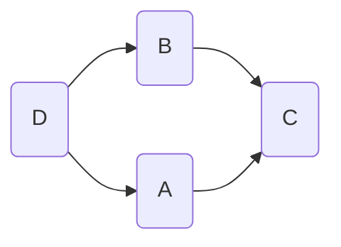
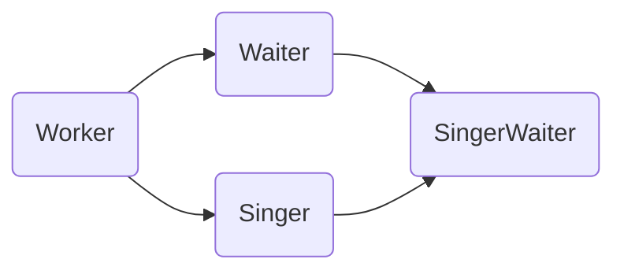
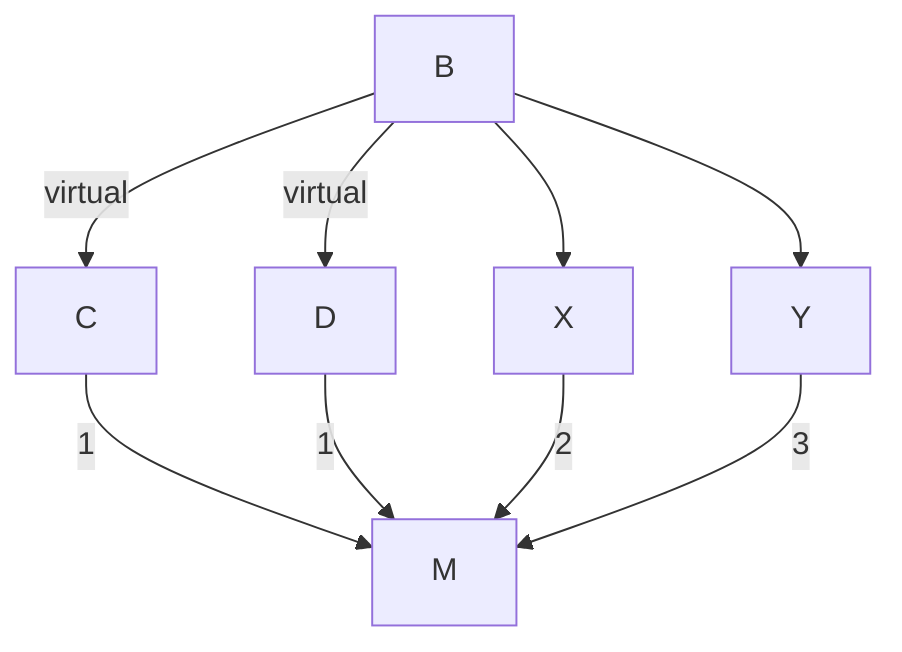
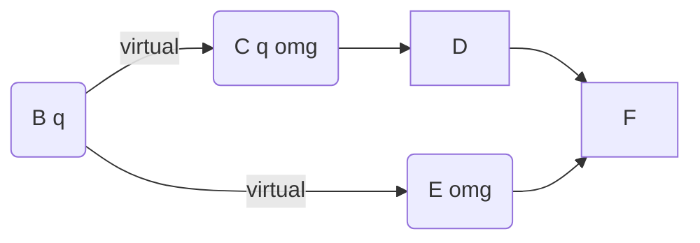

## 内存分段

由于 C/C++ 编译的程序占用的内存布局。7

### cpp 内存布局

#### 编译后

**编译后**的可执行文件中，有 `.text` `.rodata` `data`

- 没有 `.bss`——由于全是0 出于节省空间就不再指定了
- 没有 `堆 栈` 运行时才分配。
- 没有 内核空间 内存映射段 操作系统运行时分配。


#### 运行时

##### 虚拟内存 分段

**运行时**的内存模型（也就是**虚拟内存**），本质上：

- `.text` 代码区
- `.rodata` 只读数据段。
  - const变量，虚函数表
    - 编译期编译器确定虚函数表
    - 虚函数表属于类，类的所有对象共享这个类的虚函数表
- `.data` 数据段。已经初始化的静态变量 （全局静态变量和局部静态变量）
- `.bss` 未初始化的 静态变量（全局静态变量 局部静态变量）默认全是0

> 以上和程序的生命周期相同。
>
> - text程序加载时被分配，程序结束后释放。
>
> - main()函数执行结束，C++运行库释放全局变量 静态变量。

- `heap` 堆。
  - 生命周期：
    - 运行时手动分配和释放。程序员管理 new delete  new[] delete[]
    - 进程结束时，操作系统释放。
- 内存映射段。文件映射，动态库，匿名映射。
- `stack` 栈。
  - 函数参数值，局部变量值 etc
  - 生命周期：离开作用域后系统自动释放。编译器自动分配释放。
- 内核空间。操作系统管理。


##### 为什么分段

为什么把程序的指令和数据分成多段？

- **共享指令**，节省空间：最重要

  运行多个程序时，指令可以只保存一份。与数据区分开来，实现指令共享，节省资源。

- 保护只读区域：防止程序的指令无意的修改。

- 提高cup缓存命中率：提高程序的局部性，现代CPU的缓存一般分为 指令缓存和数据缓存，从而提高cup缓存命中率。


### new malloc流程

#### new

new流程

1. 调用operator new，（new是一个操作符）

2. 分配内存

   - 在free store 生成对象

     free store可能在堆上 也可能在我们自己定义的地方，

   - 可以认为，虚拟内存到物理内存的映射关系早已经完成 

3. 调用 构造函数(生成虚表指针)。

#### malloc

malloc流程

1. malloc申请的是虚拟内存 
   - 还要再完成缺页才会到物理内存)
   - 失败时 默认throw异常。
2. malloc维护一个内存池，
   - 小于128k
     - 通过break从内存池中分配 
     - free释放后 不一定擦除 会回到内存池中。
   - 大于128k
     - mmap每次都是系统调用 free释放后操作系统会立刻回收
     - 多十六个字节的向前偏移，描述分配的大小 所以free时不需要知道具体的类型。


## 虚函数表

[c++中虚析构函数如何实现多态的、内存布局如何？ - 知乎 (zhihu.com)](https://www.zhihu.com/question/36193367/answer/2242824055)

### 无继承

无虚函数（无继承）

1. 静态数据成员虽然属于类，但不占用具体类对象的内存。
2. 成员函数在代码区，不占用具体类对象内存空间。
3. 内存对齐
   - 均是按照声明的顺序在内存中有序排布，并适当对齐。
   - 数据成员的访问级别并不影响其在内存的排布和大小，

有虚函数（无继承）

- 在对象的起始处存储的是 虚指针vptr
- 对象只会有一个虚指针vptr：所以虚函数的多少都不会再改变类的大小
- 虚指针所指向的虚表保存若干函数指针（虚函数）
- 虚指针vptr大小
  - 与其它指针大小相同，根据操作系统的不同 4/8 字节
  - 同样存在内存对齐


### 单一继承

无虚函数（单一继承）

- 每个 派生类 中起始位置都是**Base class subobject**
- 虚析构
  - 当一个派生类对象经由一个base class指针被删除，而该base class带着一个non-virtual析构函数其结果未有定义——实际执行时通常发生的是对象的derived成分没被销毁。
  - 带多态性质的基类应该声明一个virtual析构函数。
  - 如果class带有任何virtual函数，它就应该拥有一个virtual析构函数。

有虚函数（单一继承）

- 每个 派生类 中起始位置仍然都是**Base class subobject**，
  - 开始是一个虚表指针
- 其虚函数表会更加的复杂。
  - 指针中的内容是被采纳的重定义的函数指针。


### 多重继承

在开头存放各个基类subobject及各自的vptr（各个基类分别有自己的vptr）然后才是自己的数据成员。

**Thunk解释**：所谓thunk是一小段assembly代码，用来

- (1)以适当的offset值调整this指针，

  派生类中也会记录其到各个base subobject的offset。

- (2)跳到virtual function去。

**随着base class的数量增多，派生类里也会首先顺序存放各个基类subobject**。


### 菱形继承

D中依次存放基类B subobject和基类C subobject。其中B和C中均存放一份class A subobject。

**浪费存储空间，而且造成了数据访问的二义性**


### 虚拟继承

Class如果内含一个或多个virtual base subobjects，将被分割成两部分：

- 不变区域

  - 从object的开头算起

    不变区域中的数据，不管后继如何衍化，总有固定的offset

  - 这一部分可以直接存取

- 共享区域

  - 表现的就是virtual base class subobject
  - 这部分数据的位置会因为每次的派生操作而发生变化，
  - 只可以被间接存取。

内存从头到尾

- 不变区域
  - 直接的基类B和C按照声明的继承顺序，在D的内存中顺序安放。
  - 紧接着是D的data member。
- 然后是共享区域virtual base class A。


## Virtual

### 虚方法

#### 概念

**虚函数** 是在基类中使用关键字 **virtual** 声明的函数。

在基类方法的声明中使用关键字`virtual`，可以使该方法在基类以及所有的派生类（包括从派生类中派生出的类）中是虚的。在派生类中重新定义基类中定义的虚函数时，会告诉编译器不要静态链接到该函数，使用**动态联编**。

> 动态联编：使用指向对象的引用或指针来调用虚方法，程序将使用对象类型定义的方法，而不是使用引用或指针类型定义的方法。

仅仅针对，派生类中预期将被**重新定义**的方法，声明为虚方法。

如果要在派生类中重新定义基类的方法，则将它设置为虚方法，否则，设置为非虚方法。

> 如果不希望重新定义方法，则不必将其声明为虚方法。
>
> 这样虽然无法禁止他人重新定义方法，但表达了这样的意思：我不希望它被重新定义。

虚函数**必须实现**，如果不实现，编译器将报错。

使用虚方法形成多态必须具备三个条件：

> 基类中有虚函数 必须发生继承 派生类必须**重写虚函数**

在基类方法的声明中使用关键字`virtual`，可以使该方法在基类以及所有的派生类（包括从派生类中派生出的类）中是虚的。派生类中的虚方法可以不加virtual，但为了方便阅读建议写上

```c++
class Base{public://虚函数 
    virtual void speak(){ cout << "Base is talking" << endl;} 
}; 
class Derived:public Base{public: 
    //重写虚函数 可以不加virtual，但为了方便阅读建议写上
    virtual void speak() {cout << "Derived is talking" << endl;} 
};
```

虚函数是C++中用于实现多态(polymorphism)的机制。核心理念就是通过基类访问派生类定义的函数。

**只有成员函数才可以是虚函数**的，因此友元不能是虚拟函数。但可以通过让友元函数调用虚拟成员函数来解决友元的虚拟问题。

**析构函数**应当是虚函数，除非类不用做基类。也有说法是，在有**动态分配堆上内存**的时候，**析构函数**必须是**虚函数**。

通常给基类提供一个虚析构函数，即使它并不需要析构函数。

> 一个类不做基类，但是仍给它定义一个虚析构函数并非错误，只是一个效率问题。

确保释放派生类对象时，按正确的顺序调用析构函数。

#### 调用

动态联编：使用指向对象的引用或指针来调用虚方法时，

程序将使用**对象类型**定义的方法，而不是使用引用或指针类型定义的方法。

##### 调用区别

方法是通过引用或指针调用，（而不是对象调用），将采取基类中的方法还是派生类的方法，与是否使用`virtual`有关。

- 使用`virtual`，根据 引用或指针 **指向的对象的类型**来选择方法。
- 没有`virtual`，根据 引用或指针 的**类型**选择方法。

虚函数的这种行为非常方便，因此经常在基类中，将派生类会重新定义的方法声明为**虚方法**。

派生类中的虚方法可以不加virtual，但为了方便阅读建议写上

> 方法在基类中被声明为虚后，它在派生类中将自动成为虚方法。
>
> 然而，在派生类声明中使用关键字`virtual`来指出哪些函数是虚函数，是一种良好的编程习惯。

```cpp
class Base{public://虚函数 
    virtual void v_speak(){ cout << "Base is talking" << endl;}
    void speak(){ cout << "Base is talking" << endl;}
}; 
class Derived:public Base{public: 
    //重写虚函数 可以不加virtual，但为了方便阅读建议写上
    virtual void v_speak(){cout << "Derived is talking" << endl;}
    void v_speak(){cout << "Derived is talking" << endl;} 
};
```

###### virtual

使用`virtual`，根据 引用或指针 **指向的对象的类型**来选择方法。

```cpp
Base base01;
Derived derived01;
// 基类的指针或引用可以指向子类的对象 
/* 引用 */
Base & ref01 = base01;
Base & ref02 = derived01; 
ref01.speak(); // Base is talking
ref02.speak(); // Base  is talking
/* 指针 */
Base * p01 = base01;
Base * p02 = derived01; 
p01->speak(); // Base is talking
p02->speak(); // Base is talking
```

###### 没有virtual

没有`virtual`，根据 引用或指针 的**类型**选择方法。

```cpp
Base base01;
Derived derived01;
// 基类的指针或引用可以指向子类的对象 
/* 引用 */
Base & ref01 = base01;
Base & ref02 = derived01;
ref01.v_speak(); // Base is talking
ref02.v_speak(); // Derived is talking
/* 指针 */
Base * p01 = base01;
Base * p02 = derived01; 
p01->v_speak(); // Base is talking
p02->v_speak(); // Derived is talking
```

###### 对象调用

```cpp
// 如果是对象调用，则只与对象类型有关
base01.show(); // Base::show()
derived.show(); // Derived::show()
```


##### 基类调用基类方法

派生类初始化基类私有数据时，采用的时成员初始化列表语法。

```cpp
Derived::Derived(const string & s, long an, double bal)
    :Base(s,an)
{max = bal;}
Derived::Derived(Base & ba, double bal):Base(ba)
{max = bal;}
```

在派生类方法中，标准技术是使用作用域解析运算符`::`来调用基类方法。

> 如果没有作用域解析运算符`::`，编译器将认为`Show()`是`Derived::Show()`，从而创建一个递归函数。
>
> 如果派生类没有重新定义该方法，代码不必使用作用域解析运算符`::`。但建议使用，保持良好的习惯。

```cpp
void Derived::Show() const
{
    Base::Show();
    cout << "new members:" << num;
}
```


#### 虚析构

析构函数应当是虚函数，除非类不用做基类。也有说法是，在有**动态分配堆上内存**的时候，**析构函数**必须是**虚函数**。

通常给基类提供一个虚析构函数，即使它并不需要析构函数。

> 一个类不做基类，但是仍给它定义一个虚析构函数并非错误，只是一个效率问题。

确保释放派生类对象时，按正确的顺序调用析构函数。

**析构函数应当是虚函数**，如果指针指向的是派生类对象，将调用子类的析构函数，然后自动调用基类的析构函数。

> 先调用派生类的析构函数，之后调用基类的析构函数。
>
> 基类的虚析构函数必须存在，即使它不执行任何操作。
>
> ```cpp
> virtual ~Myclass(){}
> ```

如果析构函数不是虚的，则delete语句将只调用对应于指针类型的析构函数。

> ```cpp
> Base * pb = new Derived;
> delete pb; // 只调用~Base()
> Base * pd = new Derived;
> delete pd; // 只调用~Derived()
> ```


纯虚析构

```c++
virtual ~Animal()=0;
```


#### 隐藏方法

###### 隐藏方法

重新定义将隐藏方法。

重新定义继承的方法不是重载。派生类中重新定义函数时，会隐藏基类的同名函数。（无关特征标，全部隐藏）

- 不是使用相同的函数特征标覆盖基类声明，
- 而是**隐藏同名的基类方法**，**不管参数特征标如何**。

```cpp
class Base{
    public:
    virtual Base & myfunc(int n);
};
class Derived{
    public:
    virtual Derived & myfunc();
};
Derived derived01;
derived.myfunc();  // 正确
derived.myfunc(4); // 非法
```

###### 经验规则

引出两条经验规则

- 如果重新定义继承的方法，应确保与原来的原型完全相同（特征标相同，允许**返回类型协变**）。
- 如果基类声明被重载了，应在派生类中重新定义所有的基类版本。
  如果只重新定义了一个版本，则其他版本将被隐藏，派生类对象无法使用它们。

```cpp
class Base{
    public:
    virtual void myfunc(int n) const;
    virtual void myfunc(double n) const;
    virtual void myfunc() const;
};
class Derived{
    public:
    virtual void myfunc(int n) const;
    virtual void myfunc(double n) const;
    virtual void myfunc() const;
};
void Derived::myfunc(int n) const{Base::myfunc(int n);}
void Derived::myfunc(double n) const{Base::myfunc(double n);}
void Derived::myfunc() const{Base::myfunc();}
```


###### 返回类型协变

如果返回类型是**基类引用或指针**，可以修改为指向**派生类的引用或指针**。

返回类型协变允许**返回类型**随类的类型变化而变化。

```cpp
class Base{
    public:
    virtual Base & myfunc(int n);
};
class Derived{
    public:
    virtual Derived & myfunc();
};
```


#### 函数指针

数组中，所有元素的类型必须相同，而`Base`基类和`Derived`派生类是不同的类型。

由于使用的是公有继承模型，`is-a`关系，所以`Base`基类指针，可以指向 基类对象，也可以指向派生类对象。

因此，可以使用一个数组来表示多种类型的对象。这就是**多态性**。

```cpp
Base * arbase[10];
arr_base[0] = new Base(1,2);
arr_base[1] = new Derived(1,2,3);
/* 多态性 */
// 指针为Base类 
// 如果show()不是虚函数
arr_base[0]->show(); // Base::show()
arr_base[1]->show(); // Derived::show()
// 如果show()是虚函数
arr_base[0]->show(); // Base::show()
arr_base[1]->show(); // Base::show()
// 如果是对象调用，则只与对象类型有关
(*arr_base[0]).show(); // Base::show()
(*arr_base[1]).show(); // Derived::show()
/* 释放内存 */
delete arr_base[0];
delete arr_base[1];
```


##### 构造函数

构造函数不能是虚函数。

创建派生类对象时，将调用派生类的构造函数，而不是基类的构造函数。

派生类的构造函数将使用基类的一个构造函数，这种顺序不同于继承机制。因此派生类不继承基类的构造函数，将类构造函数声明为虚没有意义。


#### 静态/动态联编

是针对，指针或引用而言的。

##### 向上/下强制类型转换

> 将 派生类引用或指针 转换为 基类引用或指针 被称为 **向上强制转换**(upcast)
>
> 将 基类引用或指针 转换为  派生类引用或指针 被称为 **向下强制转换**(downcasting)。

##### 概念

**编译器**负责的任务之一：程序调用函数时，将使用哪个**可执行代码块**？

**函数名联编**（binding）：将源代码中的函数调用，解释为执行特定的函数代码块。

- C语言中，每个函数名都对应一个不同的函数。
- C++中，由于函数重载的缘故，这项任务更加复杂。需要查看函数参数、函数名。

**静态联编**（static binding）：在**编译过程中**进行联编。也称为早期联编。但虚函数使得不能在编译时确定使用哪一个函数。

**动态联编**（dynamic binding）：在**程序运行时**，选择正确虚函数的代码。也称为晚期联编。

> 大多数情况下，动态联编很好，因为它让程序能够选择为特定类型设计的方法。

动态联编与通过指针和引用调用方法相关。隐式向上强制类型转换，使基类指针或引用 可以指向 基类对象或派生类对象，因此需要**动态联编**。

使用**虚成员函数**来满足这种需求。

###### 静态联编

在**编译过程中**进行联编。也称为早期联编。但虚函数使得不能在编译时确定使用哪一个函数。

编译器对非虚方法使用静态联编。

```cpp
Derived derived01;
Base * bp;
bp = &derived01;
bp->ViewAct(); // 非虚方法
// 指针类型在编译时已知
// 调用 Base::ViewAct()
```

###### 动态联编

**动态联编**（dynamic binding）：在**程序运行时**，选择正确虚函数的代码。也称为晚期联编。

编译器对虚方法使用动态联编。

大多数情况下，动态联编很好，因为它让程序能够选择为特定类型设计的方法。

```cpp
Derived derived01;
Base * bp;
bp = &derived01;
bp->ViewAct(); // 虚方法
// 对象的指针类型在编译时未知
// 对象类型为Derived 调用 Derived::ViewAct()
```

##### 特性

###### 动态联编不是默认

动态联编允许我们重新定义类方法，而静态联编这方面很差。

但仍不摒弃静态联编的原因：**效率**和**概念模型**。

**效率**：动态联编为了使程序能够在运行阶段进行决策，必须采取一些方法来跟踪基类指针或引用指向的对象类型，增加了额外的处理开销。

> 类不用做基类，派生类不重定义基类的任何方法，则不需要使用动态联编。
>
> C++的指导原则之一，不为不使用的特性付出代价（内存或处理时间）。仅当程序设计确实需要虚函数时，才使用它们。

**概念模型**：设计类时，可能包含一些不在派生类重新的成员函数，则不将该函数设计为虚函数。

表明，仅将派生类中，预期将被重新定义的方法声明为虚。

如果要在派生类中重新定义基类的方法，则将它设置为虚方法，否则，设置为非虚方法。

使用虚函数（动态联编），在内存和执行速度方面有一定的成本：

- 每个对象都将增大，增大量为存储地址的空间；
- 对于每个类，编译器都创建了一个虚函数地址表（数组）；
- 对于每个函数调用，都需要执行一项额外的操作，即到虚函数表中查找地址。


###### 如何工作

不需要知道虚函数的实现方法就可以使用虚函数，但是了解虚函数的工作原理有助于理解概念。

**编译器处理虚函数**：

给每个对象（基类，派生类们）添加一个隐藏成员（1个指针）

> 无论类中包含的虚函数有多少个，都只对应一个虚函数表，只是这个表的大小不同而已。

该指针指向一个**函数地址数组**，称为**虚函数表**（virtual function table, vtble）。

虚函数表中存储了类对象进行声明的**虚函数的地址**。

> 每个派生类对象 都包含一个指向独立地址表的指针。
>
> 如果派生类提供了虚函数的新定义，该虚函数表将保存新函数的地址；
>
> 否则保存函数原始版本的地址。

过程：

```cpp
Derived derived01(1,2);
Base * pb = &derived01;
pb->show(); // 虚函数
```

获悉对应的vcptr地址(derived01的vcptr)。前往该指针指向的虚函数表，获悉表中函数的地址。执行对应函数指针的函数。`Derived::show();`


**虚函数** 是在基类中使用关键字 **virtual** 声明的函数。在派生类中重新定义基类中定义的虚函数时，会告诉编译器不要静态链接到该函数。

**虚函数必须实现**，如果不实现，编译器将报错。

我们想要的是在程序中任意点可以根据所调用的对象类型来选择调用的函数，这种操作被称为**动态链接**，或**后期绑定**。

```c++
virtual void speak() //虚函数 
{ 
	cout << "动物在说话" << endl; 
} 
```


##### 纯虚函数

您可能想要在基类中定义虚函数，以便在派生类中重新定义该函数更好地适用于对象，但是您在基类中又不能对虚函数给出有意义的实现，这个时候就会用到纯虚函数。

```C++
// pure virtual function
virtual int speak() = 0;
= 0 告诉编译器，函数没有主体，上面的虚函数是纯虚函数。
```

纯虚函数一定没有定义，**纯虚函数用来规范派生类的行为，即接口**。包含**纯虚函数**的类是==**抽象类**==，==抽象类不能定义实例==，但可以声明指向实现该抽象类的具体类的指针或引用。

##### 数据抽象 数据封装

**数据封装**是一种把 **数据** 和 操作数据的**函数** 捆绑在一起的机制，

**数据抽象**是一种仅向用户**暴露接口**而把具体的实现细节隐藏起来的机制。

通常情况下，我们都会设置类成员状态为私有（private），除非我们真的需要将其暴露，这样才能保证良好的**封装性**。

这通常应用于数据成员，但它同样适用于所有成员，包括虚函数。

```c++
#include <iostream>
using namespace std;
 
class Adder{
   public:
      // 构造函数
      Adder(int i = 0)
      {
        total = i;
      }
      // 对外的接口
      void addNum(int number)
      {
          total += number;
      }
      // 对外的接口
      int getTotal()
      {
          return total;
      };
   private:
      // 对外隐藏的数据
      int total;
};
int main( )
{
   Adder a;
   a.addNum(10);
   cout << "Total " << a.getTotal() <<endl;
   return 0;
}
```

##### 接口（抽象类）

接口描述了类的行为和功能，而不需要完成类的特定实现。

C++ 接口是使用**抽象类**(ABC)来实现的，抽象类与数据抽象互不混淆，数据抽象是一个把实现细节与相关的数据分离开的概念。

如果类中至少有一个函数被声明为纯虚函数，则这个类就是抽象类。纯虚函数是通过在声明中使用 "= 0" 来指定的

```c++
包含纯虚函数 Box是抽象类 ABC
class Box
{
   public:
      // 纯虚函数
      virtual double getVolume() = 0;
   private:
      double length;      // 长度
      double breadth;     // 宽度
      double height;      // 高度
};
// 派生类 具体类
class smallbox: public Box
{
public:
   double getVolume()
   { 
      return (length * breadth * height); 
   }
};
```

设计**抽象类**（通常称为 ABC）的目的，是为了给其他类提供一个可以继承的适当的基类。抽象类不能被用于实例化对象，它只能作为**接口**使用。如果试图实例化一个抽象类的对象，会导致编译错误。

因此，如果一个 ABC 的子类需要被实例化，则必须实现每个虚函数，这也意味着 C++ 支持使用 ABC 声明接口。如果没有在派生类中重写纯虚函数，就尝试实例化该类的对象，会导致编译错误。

可用于实例化对象的类被称为**具体类**。

面向对象的系统可能会使用一个抽象基类为所有的外部应用程序提供一个适当的、通用的、标准化的接口。然后，派生类通过继承抽象基类，就把所有类似的操作都继承下来。

外部应用程序提供的功能（即公有函数）在抽象基类中是以纯虚函数的形式存在的。这些纯虚函数在相应的派生类中被实现。


### 抽象类

抽象基类，ABC `abstract base class`

抽象基类ABC， 至少包含一个纯虚函数，不能创建抽象基类的对象。

> 描述的是至少使用一个纯虚函数的接口(其他接口可以是普通虚函数)，从ABC派生出的类将根据派生类的具体特征，使用常规虚函数来实现这种接口。

可以将ABC看作是一种必须实施的接口，要求具体派生类覆盖其纯虚函数——迫使派生类遵循ABC设置的接口规则。

一种学院派思想：如果要设计类继承层次，则只能将那些不会被用作基类的类设计为具体的类。这种方法的设计更清晰，复杂度更低。

#### 纯虚函数

类声明包含纯虚函数时，不能创建该类的对象。

> 包含纯虚函数的类只能用作基类，要成为真正的 抽象基类ABC，至少包含一个纯虚函数。

C++允许纯虚函数有定义。在基类中声明纯虚函数后，仍然可以提供这种方法的定义。

```cpp
class Base
{
    public:
    virtual double Area() const = 0;
};
double Base::Area(){x = 0;y = 0;}
```

在原型中使用=0，指出类时一个抽象基类。在类中可以不定义该函数。

```cpp
class Base
{
    public:
    virtual double Area() const = 0;
};
// 定义或不定义这个函数都是正确的
```


##### 用途

抽象出B1类 B2类的共性，将这些特性放在A类中。但是，无法在A类中直接提供这些方法，因为A类中没有包含必要的数据成员。

C++通过纯虚函数（pure virtual function）提供未实现的函数。

B1类 B2类被称为具体类，可以创建这些类型的对象。A类可以同时管理这两个类的对象。

从抽象基类`A`派生出的类`B1  B2`，将根据派生类的具体特征，使用常规虚函数来实现虚函数(其中至少一个纯虚函数)提供的接口。

##### 示例

定义**AcctABC**为**抽象基类ABC**，这个类包含 **Brass类 BrassPlus类**共有的所有方法和数据成员。

**具体类 Brass类 BrassPlus类** 中的行为不同的方法被声明为**虚函数**，其中至少有一个虚函数是**纯虚函数**（使AcctABC成为抽象类）。

ABC提供了一些**保护方法**，帮助派生类访问基类数据。（这些方法不是共有接口的组成部分）

一种学院派思想：如果要设计类继承层次，则只能将那些不会被用作基类的类设计为具体的类。这种方法的设计更清晰，复杂度更低。

ABC提供**保护成员函数**，用于处理格式化。


###### 存在与外界重名的函数

- 将这些函数声明为静态，它们将为不同的`.cpp`所私有。
- 将这些函数与结构放在一个独立的名称空间中。
- 将这些函数与结构放在类定义的保护部分，基类和派生类可用，同时对外隐藏它们。


#### 虚继承

> class 类名: virtual 继承方式 父类名
>
> class B: virtual public D{......};



```c++
class D{......};
class B: virtual public D{......};
class A: virtual public D{......};
class C: public B, public A{.....};
```


### 多重继承

#### 多重继承

继承使用了多个基类，称为 **多重继承(multiple inheritance，MI)**。

##### 菱形继承问题

通常，MI（尤其是公有多重继承）将导致一些问题，需要使用额外的语法规则来解决它们。

- 从两个不同的基类继承**同名方法**。
- 从两个或更多基类那里继承同一个类的**多个实例**。


```cpp
class Worker{......};
class Waiter: public Worker{......};
class Singer: public Worker{......};
class SingerWaiter: public Waiter, public Singer{.....};
```




类A和类B都继承了一个D组件，因此类C将包含两个D组件。

```cpp
/* 将派生类对象的地址赋给基类指针，将出现二义性 */
// 这种赋值将把基类指针设置为派生对象中的基类对象的地址
// ed中包含两个Worker对象，有两个地址可供选择。导致二义性。
SingerWaiter ed;
Worker * pw = & ed;
// 需要使用类型转换来指定对象
Worker * pw1 = (Waiter *) &ed; // Waiter中的Worker
Worker * pw2 = (Singer *) &ed; // Singer中的Worker
```

这使得使用基类指针来引用不同的对象（多态化）复杂化。


##### 虚基类

###### virtual

虚函数和虚基类之间并不存在明显的联系。

这种新特性也使用关键字`virtual`，是为了避免引入新的关键字。有点类似于关键字重载。

###### 格式

虚基类 `virtual base class`使MI成为可能。

虚基类 使得：从多个拥有相同基类的类，派生出的对象只继承一个基类对象。

```cpp
// virtual 和 public 的次序无关紧要
class Singer : virtual public Worker {};
class Waiter : public virtual Worker {};
// 然后将派生类定义为
class SingingWaiter : public Singer, public Waiter {};
```

此时`SingingWaiter`对象将只包含`Worker`对象的一个副本。

> 本质上，继承的Singer和Waiter对象，共享一个Worker对象。而不是各自引入自己的Worker对象副本。


##### 构造函数规则

###### 默认构造函数

非虚基类，唯一可以出现在初始化列表中的构造函数是即使基类构造函数。这些构造函数可能需要将信息传递给基类。

虚基类，这种通过构造函数的信息自动传递是不起作用的。

```cpp
SiningWaiter(const Worker & wk, int p = 0, int v = Singer::other)
    : Waiter(wk,p), Singer(wk,v){} // 无效的。编译器将使用Worker的默认构造函数
```

自动传递信息时，通过两条不同的路径，将wk传递给Worker对象。这种情况下，编译器将使用Worker的**默认构造函数**。

所以，C++在基类为虚时，**禁止**信息通过中间类自动传递给基类。

###### 显式调用构造函数

如果类有间接虚基类，则除非只需使用该虚基类的默认构造函数，否则必须显式地调用该虚基类的某个构造函数。

```cpp
/* 显式地调用所需的基类构造函数 */
SingingWaiter(const Worker & k, int p = 0, int v = Singer::other)
    : Worker(wk), Waiter(wk,p),Singer(wk,v){}
```

显式地调用构造函数`worker(const Worker &)`。

对于虚基类，这是必须的；但对非虚基类，是非法的。

#### 多重继承二义性

##### 二义性

多重继承可能导致函数调用的二义性。

- 对于单继承，如果没用重定义，则可以直接使用最近祖先中的定义。
- 多重继承中，每个祖先都可能有同名函数，使得调用是二义性的。

```cpp
SingingWaiter newhire("Elise", 2005, 6, soprano);
newhire.Show(); // 调用有二义性
newhire.Singer::Show(); // 使用Singer的Show版本
```

##### 解决

###### 作用域解析运算符

使用作用域解析运算符澄清意图

```cpp
SingingWaiter newhire("Elise", 2005, 6, soprano);
newhire.Show(); // 调用有二义性
newhire.Singer::Show(); // 使用Singer的Show版本
```

###### 重定义

在派生类的派生类`SingingWaiter`中重新定义`Show()`，指出要使用哪个`Show`

```cpp
void SingingWaiter::Show()
{
    Singer::Show();
}
SingingWaiter newhire("Elise", 2005, 6, soprano);
newhire.Show(); // 调用指定的Singer的Show版本
```

##### 递增方法

单继承让派生方法调用基类的方法是可以的。

```cpp
void Waiter::Show() const
{
    Worker::Show();
    cout << "Panache rating " << panache << "\n";
}
void SingingWaiter::Show() const 
{
    Waiter::Show();
    cout << "Presence rating " << presence << "\n";
}
```

然而，这种递增的方式对`SingingWaiter`示例无效，因为它忽略了`Waiter`组件。

```cpp
void SingingWaiter::Show()
{
    Singer::Show();
}
```

可以通过同时调用多个版本的`Show()`来补救，尽管这会导致一些问题（例如，重复输出相同的内容）。

```cpp
void SingingWaiter::Show()
{
    Singer::Show();
    Waiter::Show();
}
```


##### 模块化方式

**分别**提供 

- 一个只显示`Worker`组件的方法
- 一个只显示`Waiter`组件 或 一个`Singer`组件的方法。

然后，在`SingingWaiter::Show()`方法中，将组件组合起来。

> 下例中，`Show()`方法组合了`Data()`组件。
>
> 对象仍可使用`Show()`方法，而`Data()`方法只在类内部可用，作为协助公有接口的辅助fan

```cpp
void Worker::Data() const
{
    cout << "Name: " << fullname << "\n";
    cout << "ID  : " << id << "\n"; 
}
void Waiter::Data() const
{
    cout << "Panache rating :  "  << panache << "\n";
}
void Singer::Data() const
{
    cout << "Vocal range : " << pv[voice] << "\n";
}
void SingingWaiter::Data() const
{
    Singer::Data();
    Waiter::Data();
}
void SingingWaiter::Show() const
{
    Worker::Data();
    Data();
}
```


##### 混合虚/非虚基类

混合使用虚基类和非虚基类。

类通过多条虚途径和非虚途径继承某个特定的基类时，该类将包含：

- **一个**表示**所有的虚途径**的基类子对象。
- **分别**表示各条非虚途径的**多个**基类子对象。

例子：

`B`类被用作类C和D的虚基类。同时，被用作类X和Y的非虚基类。类`M`从类`C D X Y`派生而来。

> 类M从虚派生祖先（类C 和D）那里共继承了一个B类子对象。
>
> 每一个非虚派生祖先（类X 和 Y）分别继承了一个B类子对象。



##### 优先规则

从不同的类继承了两个或更多的同名成员（数据或方法）

- 非虚基类：不进行限定，将导致二义性。
- 虚基类：不一定导致二义性，派生类中的名称优先于直接或间接祖先类中的相同名称。

虚二义性规则 与 访问规则 无关。

- 对于私有的成员/私有的方法，即使不能访问，也会有更高的优先级。会去调用不可访问的 成员/ 方法。

- `E::omg()`是私有的`C::omg()`仍是公开的，`omg()`也会有二义性。
- `C::q()`是私有的`B::q()`仍是公开的，`q()`仍然会调用不可访问的`C::q()`。

```cpp
class B
{
    public: short q();
};
class C : virtual public B
{
    public:
    long q();
    int omg();
};
class D : public C
{};
class E : virtual public B
{
    private:
    int omg();
};
class F : public D,public E
{};
```




F中的方法

- 可以用`q()`来表示`C::q()`
- `omg()`将导致二义性。C和E都不是对方的基类，任何一个`omg()`定义都不优先于其他`omg()`定义。

虚二义性规则 与 访问规则 无关。

- 对于私有的成员/私有的方法，即使不能访问，也会有更高的优先级。会去调用不可访问的 成员/ 方法。
- `E::omg()`是私有的`C::omg()`仍是公开的，`omg()`也会有二义性。
- `C::q()`是私有的`B::q()`仍是公开的，`q()`仍然会调用不可访问的`C::q()`。


### override final

override final 并非关键字，而是具有特殊含义的标识符。

##### 重写

虚方法，存在问题

在基类声明了一个虚方法，在派生类中提供不同的版本。

- 如果特征标**匹配**，将**覆盖旧版本**。
- 如果特征标**不匹配**，将**隐藏旧版本**。

**隐藏**基类中的旧版本，将会导致基类中的其它重名函数无法使用。

```cpp
class Base{
public:
    ...
    virtual void f(char ch) const { cout << 1;};
};
class Derived : public Base{
public:
    ...
    virtual void f(char *ch) const { cout << 2;};
};
```


```cpp
Derived b();
b.f("a"); // 调用派生类的void f(char*)const
b.f('a'); // 错误，无法调用基类的被隐藏的void f(char)const
```


##### override

`virtual void func(char ch) const override;`

override 虚说明符，指出要覆盖的一个虚函数。

- 如果声明于基类方法不匹配，编译器将视为错误。
- 禁止隐藏，允许覆盖。
- - 只**允许**特征标**匹配**，**允许覆盖旧版本**。
  - **不允许**特征标**不匹配**，**不允许隐藏旧版本**。

```cpp
class Base{
public:
    ...
    virtual void f(char ch) const override { cout << 1;};
};
class Derived : public Base{
public:
    ...
    /* 此时，直接报错 —— 特征标不一致 */
    virtual void f(char *ch) const { cout << 2;};
};
```

错误信息可能是
`method with override specifier 'override' did not override any base class method`

##### final

`virtual void func(char ch) const final;`

final 虚说明符，指出要隐藏的一个虚函数。

- 如果声明于基类方法不匹配，编译器将视为错误。
- 禁止覆盖，允许隐藏。
- - **不允许**特征标**匹配**，**不允许覆盖旧版本**。
  - **允许**特征标**匹配**，**允许隐藏旧版本**。

```cpp
class Base{
public:
    ...
    virtual void f(char ch) const override { cout << 1;};
};
class Derived : public Base{
public:
    ...
    /* 此时，直接报错 —— 特征标一致 */
    virtual void f(char ch) const { cout << 2;};
};
```


## MMU

[一文搞懂MMU工作原理 - 知乎 (zhihu.com)](https://zhuanlan.zhihu.com/p/596039345)


