# 概念

## 面向对象 六原则

### SOLID 5原则

#### 单一职责原则 SRP

名称：

- 单一职责原则 SRP

- Single Responsibility Principle

定义：

- 宽泛的说
  - 对一个类而言，应该仅有一个引起它变化的原因。

- 简而言之：
  - 一个类中应该是一组相关性很高的函数、数据的封装。

必要性：

- 优化代码的第一步

评价：

- 备受争议，但及其重要的原则。想和别人争执 怄气 吵架，就对着他的代码开始谈SRP吧


#### 开闭原则 OCP

##### 定义

- 名称

  - 开闭原则 OCP

  - Open Close Principle

- 宽泛的说
  - 软件中的对象（类，模块，函数等）应该
    - 对于 拓展 是开放的
    - 对于 修改 是封闭的

- 简而言之：
  - 当软件需要变化时，应尽量通过扩展的方式来实现变化**而非修改已有代码来实现**


##### 具体实现

- 开闭原则和里氏替换原则相辅相成，通过LSP达到对拓展开放，对修改封闭的效果。

- 程序一旦开发完成，程序中一个类的实现只应该因错误而被修改

- 新的 或者 改变 的特性应该通过**新建不同的类实现**。

  新的类可以通过继承的方式重用原类的代码，覆写父类的接口以应对变化。


##### 评价

- 优点

  - 让程序更稳定，更灵活

  - 在软件的生命周期中，因为变化、升级、维护等原因需要对软件原有代码进行修改时，

    **可能将错误引入到原有代码中，破坏原有系统。**

- 应该尽量遵守

  - 完全遵守开闭原则是很理想的情况

    - 因为，在实际开发中，修改原有代码和拓展新代码往往同时存在

    - 但是，为了确保原有软件模块的正确性，应该尽量少地影响原有模块

  - 并不是说完全不修改原始类。

    在察觉到原有代码的“过时气味”时，应该尽早重构，以便代码恢复到正常的进化过程。这时继承等方式添加新的实现会导致类型的膨胀以及历史遗留代码的冗余。


#### 里氏替换原则 LSP

##### 定义

- 名称：
  - 里氏替换原则 LSP
  - Liskov Substitution Principle

- 宽泛的说：
  - 所有引用基类的地方必须能透明地使用其子类的对象
- 简而言之
  - 只要是父类能出现的地方子类就可以出现，并且替换为子类不会产生任何错误和异常
  - 使用者可能根本就不清楚使用的是父类还是子类
  - 子类应该可以实现基类的能力，并且能够完成对基类的替换
- 核心原理——抽象
  - 面向对象语言的三大特点：继承 封装 多态
  - LSP 依赖于继承


##### 具体实现

- 运行时替换掉抽象，保证系统的拓展性、灵活性；

- 开闭原则和里氏替换原则相辅相成，通过LSP达到对拓展开放，对修改封闭的效果。


##### 评价

- 优点

  - 代码重用，
    - 减少创建类的成本。
    - 每个子类都拥有父类的方法和属性。
  - 子类和父类基本相似，又有区别
  - 提高代码可拓展性

- 缺点

  - 继承是侵入式的，只要继承就必须拥有父类的所有属性和方法。

  - 子类代码冗余，灵活性降低。

    因为子类必须拥有父类的属性和方法。


#### 依赖倒置 DIP

上层不依赖底层的具体实现，上下层之间依赖彼此的抽象。

- 名称

  - 依赖倒置原则
  - Dependence Inversion Principle

- 宽泛的说

  - 指代一种特定的解耦形式

  - 高层模块不应该依赖低层模块，两者都应该依赖彼此的抽象
    - 抽象不应该依赖细节
    - 细节应该依赖抽象
  - 高层模块 —— 调用端
  - 低层模块 —— 具体实现类

- 简而言之：

  - 模块间的依赖通过抽象产生
    - 依赖关系**通过接口或抽象类产生**
    - 实现类之间**不发生直接的依赖关系**


#### 接口隔离 ISP

##### 定义

接口要简洁

- 名称

  - 接口隔离原则
  - InterfaceSegregation Principles
- 宽泛的说
  - 客户端不应该依赖它不需要的接口
- 简而言之：
  - 类间的依赖关系应该建立在最小的接口上

##### 具体实现


##### 评价

避免了过多的细节暴露在客户端代码面前，否则会导致没有很好的隐藏实现，增加接口的使用难度。

用最小化接口隔离了实现类的细节，也促使我们将庞大的接口拆分到更颗粒度的接口当中，这使得系统具有更低的耦合性，更高的灵活性。


### 最小知识 LOD

- 名称

  - 迪米特原则，最小知识原则
  - Least Knowledge Principle

- 宽泛的说

  - 一个对象应该对其他对象有最少的了解。
  - 对其他对象仅仅传递最少的信息

- 简而言之：

  - 只与直接的朋友通信。

    - 一个类应该对自己需要耦合和调用的类，保持最少的认识

    - 类的内部如何实现与调用者或者依赖者没有关系。

      调用者或依赖着只需要知道它需要的方法即可。

  - 否则，类与类之间的关系越密切，耦合度越大。

    当一个类发生改变时，对另一个类的影响也越大。


## 4种复用机制

4种复用机制：

- 继承、

- 组合、

- 委托（独特与语言的）

  java压根就没有。Cpp runtime lib 没有，C。

  server side: overload operator()

  - message queue

  client side: lambda.

- 模板

### 组合

- 组合 > 继承 随着系统演化得越来越依赖于对象组合，而不是类继承。

- 重心从对一组固定行为的硬编码（hard-coding）转移为定义一个较小的基本行为集。

- 行为可以被组合成任意数目的更复杂的行为。


### 继承

子类中有同样的字段，往上提。

##### 类继承

类 class ， 类型 type。

- 一个对象对应一个类 class

- 一个对象可以有多个类型 type —— 多继承，子类有多个基类、object就有多个type

- 不同类class的对象可以有相同的类型 type —— 不同子类，可以继承自同一个基类。


##### 接口继承

接口，即对象能够响应的请求的集合。对象的类型只和它的接口有关

根据抽象类中定义的接口操纵对象的好处：

- 客户，无需知道使用对象的特定类型，知道对象有客户期望的接口就行。
- 无需知道使用对象是用什么类实现的，知道定义接口的抽象类就行。

实现：

- 纯接口继承：公有继承纯抽象类。

- 纯实现继承 纯类继承：接近于私有继承。
- 公有继承一个含有（纯）虚成员函数的类。C++中接口继承 的标准方法


### **委托、模板**

个人之见

- 二进制级别的复用，编译单位的复用性  >=  源代码级别的复用

- 模板 >> 复制粘贴

- 运行时依赖 > 编译时依赖 


# 设计模式

## 概念

### 四要素

一个模式有四个基本要素：

- 模式名（pattern name）
- 问题（problem）：描述了应该在**何时**使用。解释了问题和问题存在的前因后果。
- 解决方案（solution）：描述了设计的组成成分、它们之间的相互关系及各自的职责和协作方式。
- 效果（consequence）：描述了模式应有的效果，及使用模式应权衡的问题。

### 六原则

- 单一职责，
- 里氏代换，
- 开闭原则

- 依赖倒置，
- 接口隔离，
- 最小知识选择


### OMT图 描述对象的实现

OMT表示法：类是一个矩形，

- **类名** 用黑体表示，在第一行。

- **类方法/操作**，在第二行、

- **成员变量**，在第三行。

抽象类/抽象操作，类名用斜体表示。

箭头

- 实现接口： `---|>`虚线箭头

  `类 --|>抽象类`

- 继承 类       `—|>—`   实线空心三角。

  `	子类—|>— 基类`

- 依赖

  - `A--->B `
  - A中的函数，需要B作为参数

- 关联

  - `A—>B `
    - A中持有 B作为成员变量
    - A中，B是函数返回值。

- 部分

  - `--<>`聚合

  - ` --<黑> `组合(更不可分割一些)  整体

- 代码  `----有褶角的框`

  ​     出现在带有褶角的框中，虚线将该褶角框与代码连接

- 混入类（mixin class）

  ​     给其他类提供可选择的接口或功能的类。

  ​     混入类，要求多继承。

  ​     和抽象类一样不能实例化。

​		`存在的类—<|—新增的类(其中有两者的操作)—|>—混入类`


## 创建型

**分类原因**

创建型设计模式抽象了实例化过程。

- 它们帮助一个系统独立于 一些对象

  - 创建它的对象

  - 组合它的对象

  - 表示它的对象

- 这些创建型设计模式，有两个不断出现的主旋律。封装该系统内：

  - **使用哪些具体的类**
  - 这些类的实例是**如何被创建和被放在一起**的。

- 创建型模式，给予了灵活性

  - **什么**被创建，**谁**创建了它，它**怎么**被创建，**何时**被创建

单例模式，工厂方法模式，抽象工厂模式，建造者模式，原型模式

| 设计模式            | 类型                 |
| ------------------- | -------------------- |
| Factory 模式        | 被实例化的子类       |
| AbstactFactory 模式 | 产品对象家族         |
| Singleton 模式      | 针对一个类的唯一实例 |
| Builder 模式        | 如何创建一个组合对象 |
| Prototype 模式      | 针对被实例化的类     |


### 单例模式

#### 用途

实现单例模式的步骤：

1、构造函数私有化
2、增加静态私有的当前类的指针变量
3、提供静态对外接口,可以让用户获得单例对象


#### 饿汉式

饿汉式：

- 还没有使用该单例对象，该单例对象就已经被加载到内存了
- 在对象过多时会造成内存浪费

需要在main函数前，为单例对象赋值。

```shell
instance created hungryly.
process started !
waiting done.
got instance
m property is  2 
process exit
```

```cpp
#include <cstdio>
#include <iostream>
#include <thread>
#include <chrono>
using namespace std;

class Singleton_hungry{
private:
    int mProp = 0;
    Singleton_hungry(int intParam = 1):mProp(intParam) {
        printf("instance created hungryly.\n");
    };
    ~Singleton_hungry() {
        if (mInstance) {
            delete mInstance;
        }
        printf("instance deleted.\n");
    }

public:
    static Singleton_hungry* mInstance;
    static Singleton_hungry* getInstance() {
        printf("got instance\n");
        if (mInstance) {
            return mInstance;
        }
        mInstance = new Singleton_hungry;
        return mInstance;
    }
    void do_print() {
        printf("m property is  %d \n", mProp);
    }
};

//以下语句需要在main函数运行前执行
Singleton_hungry* Singleton_hungry::mInstance = new Singleton_hungry(2);


int main() {
    Singleton_hungry* mHungryPtr;
    printf("process started !\n");
    std::this_thread::sleep_for(std::chrono::milliseconds(400));
    printf("waiting done.\n");
    mHungryPtr = Singleton_hungry::getInstance();
    mHungryPtr->do_print();
    std::this_thread::sleep_for(std::chrono::milliseconds(400));
    printf("process exit\n");
    return 1;
}
```


#### 懒汉式

懒汉式：

- 避免了内存浪费

- 线程不安全，可以通过工具类封装互斥量来解决。

  > 直接使用 mutex 会出错。

```cpp
#include <iostream>
#include <mutex>
#include <thread>
#include <chrono>
using namespace std;

class LockTool {
public:
    mutex mMtx;
    void lock() {
        mMtx.lock();
    }
    void unlock() {
        mMtx.unlock();
    }
};

class Singleton_lazy {
private:
Singleton_lazy() {
    printf("Instance created \n");
}
~Singleton_lazy() {}

public:
static LockTool* mMtx;
static Singleton_lazy* getInstance() {
    mMtx->lock();
    if (!mInstance) {
        mInstance = new Singleton_lazy();
    }
    mMtx->unlock();
    return mInstance;
}
static Singleton_lazy* mInstance;
};

Singleton_lazy* Singleton_lazy::mInstance = nullptr;
LockTool* Singleton_lazy::mMtx = new LockTool;

int main() {
    Singleton_lazy* mHungryPtr;
    Singleton_lazy* mHungryPtr2;
    printf("process started !\n");
    // Singleton_lazy::mMtx = mMtx;

    std::this_thread::sleep_for(std::chrono::milliseconds(400));
    printf("waiting done.\n");
    mHungryPtr = Singleton_lazy::getInstance();
    mHungryPtr2 = Singleton_lazy::getInstance();
    printf("got instance\n");
    if (mHungryPtr != mHungryPtr2) {
        printf("fail 1 instance \n");
    }

    std::this_thread::sleep_for(std::chrono::milliseconds(400));
    printf("process exit\n");
    return 1;
}
```


### 工厂模式

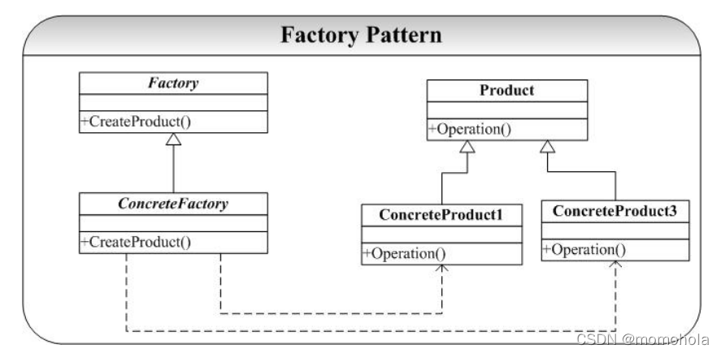

```cpp
#include <cstdio>
#include <iostream>

using namespace std;

class AbstractProduct {
public:
virtual void do_something() = 0;
};

class ConcreteProductA_1 : public AbstractProduct {
public:
    ConcreteProductA_1() {
        printf("ConcreteProductA_1 created!\n");
    }
    void do_something() {
        printf("ConcreteProductA_1 do something.\n");
    }
};

class ConcreteProductA_2 : public AbstractProduct {
public:
    ConcreteProductA_2() {
        printf("ConcreteProductA_2 created!\n");
    }
    void do_something() {
        printf("ConcreteProductA_2 do something.\n");
    }
};

class ConcreteFactory {
public:
    AbstractProduct* createProduct(int type){
        AbstractProduct* mProduct = nullptr;
        switch (type) {
        case 1:
            mProduct = dynamic_cast<AbstractProduct*>(new ConcreteProductA_1);
            break;
        case 2:
            mProduct = dynamic_cast<AbstractProduct*>(new ConcreteProductA_2);
            break;
        default:
            printf("unkown product type");
        }
        return mProduct;
    }
};

int main() {
    ConcreteFactory* mFactory = new ConcreteFactory();
    AbstractProduct* mProduct = mFactory->createProduct(1);
    mProduct->do_something();
    return 0;
}
```


### 抽象工厂

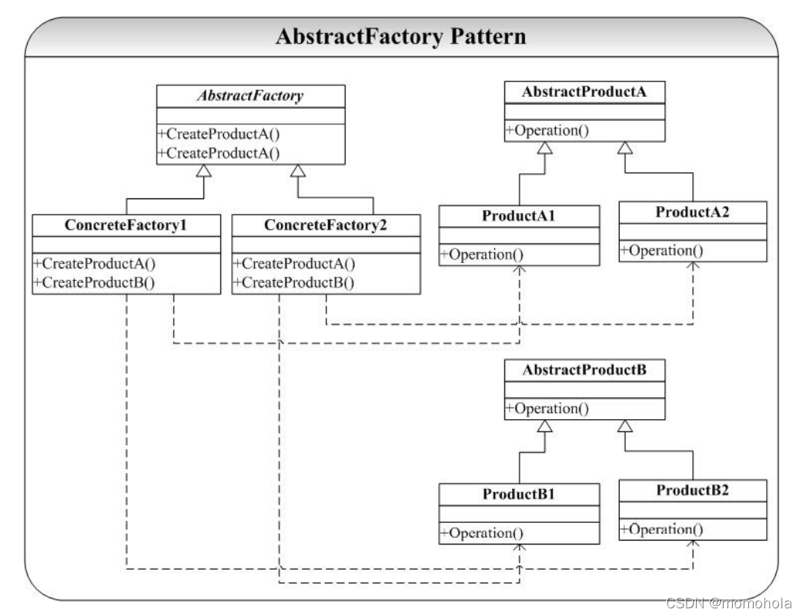


```cpp

#include <cstdio>
class AbstractProduct {
public:
    virtual void do_something() = 0;
    virtual ~AbstractProduct() {
        printf("AbstractProduct 虚析构\n");
    }
};

class AbstractProductA : public AbstractProduct {
public:
    // virtual void do_something() = 0;
    virtual void do_something_special_A() = 0;
    virtual ~AbstractProductA() {
        printf("AbstractProductA 虚析构\n");
    }
};

class AbstractProductB : public AbstractProduct {
public:
    virtual void do_something_special_B() = 0;
    virtual ~AbstractProductB() {
        printf("AbstractProductB 虚析构\n");
    }
};

class ConcreteProductA : public AbstractProductA {
public:
    void do_something() {
        printf("ConcreteProductA  do_something\n");
    }
    void do_something_special_A() {
        printf("ConcreteProductA  do_something_special_A\n");
    } 
};

class ConcreteProductB : public AbstractProductB {
public:
    void do_something() {
        printf("ConcreteProductB  do_something\n");
    }
    void do_something_special_A() {
        printf("ConcreteProductB  do_something_special_B\n");
    } 
};

class AbstractFactory {
public:
    virtual AbstractProduct* createProduct(int type) = 0;
    virtual ~AbstractFactory() {
        printf("AbstractFactory 虚析构\n");
    }
};

class ConcreteFactoryA : public AbstractFactory {
public:
    AbstractProduct* createProduct(int type) {
        AbstractProduct* mProduct = nullptr;
        mProduct = dynamic_cast<AbstractProduct*>(new ConcreteProductA);
        return mProduct;
    }
};

int main() {
    AbstractFactory* mFactory = nullptr;
    AbstractProduct* mProduct = nullptr;
    mFactory = new ConcreteFactoryA();
    mProduct = mFactory->createProduct(1);
    mProduct->do_something();
    delete mProduct;
    delete mFactory;

    // mFactory = new ConcreteFactoryB();

    return 1;
}
```


### 建造者模式

##### 概念

当我们要创建的对象很复杂的时候（通常是由很多其他的对象组合而成），我们要要复杂对象的创建过程和这个对象的表示（展示）分离开来，这样做的好处就是通过一步步的进行复杂对象的构建，由于在每一步的构造过程中可以引入参数，使得经过相同的步骤创建最后得到的对象的展示不一样。

- Builder 模式的关键是其中的 Director对象并不直接返回对象，而是通过一步步（BuildPartA，BuildPartB，BuildPartC）来一步步进行对象的创建。
- Builder 模式的示例代码中，BuildPart 的参数是通过客户程序员传入的，这里使用“user-defined”代替，实际的可在 Construct 方法中传入这 3 个参数，这样就可以得到不同的细微差别的复杂对象了。

Builder 模式和 AbstractFactory 模式在功能上很相似，因为都是用来创建大的复杂的对象，它们的区别是Builder 模式强调的是一步步创建对象，并通过相同的创建过程可以获得不同的结果对象，一般来说 Builder 模式中对象不是直接返回的。而在 AbstractFactory 模式中对象是直接返回的，AbstractFactory 模式强调的是为创建多个相互依赖的对象提供一个同一的接口。

##### OMT

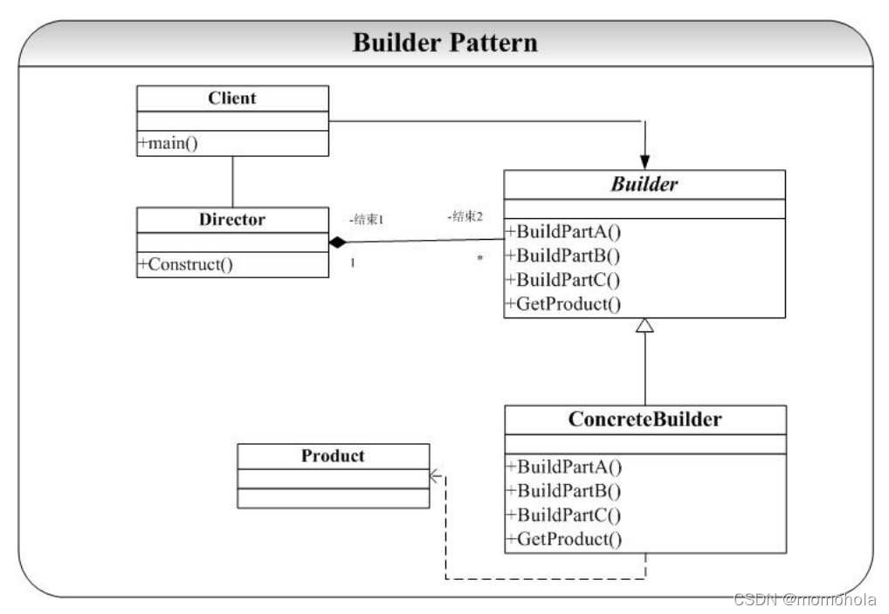


##### code

```cpp
#include <cstdio>
#include <iostream>

class Product {
public:
    std::string name;
    int level;
    void do_print() {
        printf("name = %s, level = %d \n", name.c_str(), level);
    }
};

class Builder {
public:
    Product* mProduct = nullptr;
    void set_product(Product* product) {
        this->mProduct = product;
    }
    Product* get_product() {
        return this->mProduct;
    }
    void build_name(std::string name) {
        if (this->mProduct)
            this->mProduct->name = name;
    }
    void build_level(int level) {
        if (this->mProduct)
            this->mProduct->level = level;
    }

};

class Director {
public:
    Builder* mBuilder = nullptr;
    void set_builder(Builder* builder) {
        this->mBuilder = builder;
    }
    void do_build(std::string name, int level) {
        Product* product = this->mBuilder->get_product();

        this->mBuilder->build_name(name);
        this->mBuilder->build_level(level);
    }
};


int main() {
    Product* mProduct = new Product;
    Builder* mBuilder = new Builder;
    Director* mDirector = new Director;
    mBuilder->set_product(mProduct);
    mDirector->set_builder(mBuilder);
    mDirector->do_build("张三", 100);
    mProduct->do_print();


    return 0;
}
```


### 原型模式

Prototype 模式（原型模式）

定义：Prototype 模式也正是提供了自我复制的功能，就是说新对象的创建可以通过已有对象进行创建。在 C++中拷贝构造函数（Copy Constructor）曾经是很对程序员的噩梦，拷贝又分为浅拷贝和深拷贝

- 浅拷贝：将一个对象复制后，基本数据类型的变量都会重新创建，而引用类型，指向的还是原对象所指向的。

- 深拷贝：将一个对象复制后，不论是基本数据类型还有引用类型，都是重新创建的。简单来说，就是深复制进行了完全彻底的复制，而浅复制不彻底。clone明显是深复制，clone出来的对象是是不能去影响原型对象的


Prototype 模式提供了一个通过已存在对象进行新对象创建的接口（Clone），Clone接口在 C++中我们将通过拷贝构造函数实现。

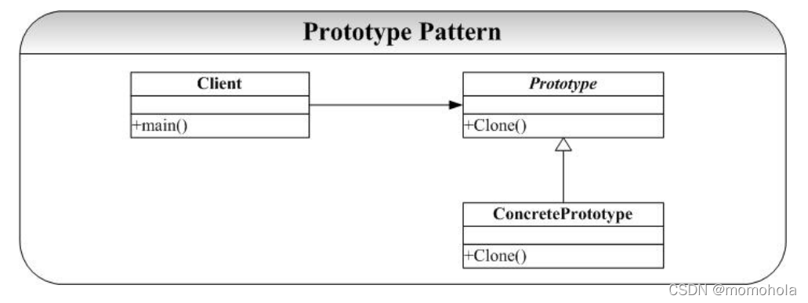


## 结构型

适配器模式，代理模式，桥接模式，装饰器模式，外观模式，组合模式，享元模式，

| 设计模式       | 类型                           |
| -------------- | ------------------------------ |
| Bridge 模式    | 对象的实现                     |
| Adapter 模式   | 针对对象的接口                 |
| Decorator 模式 | 对对象的职责，不生成子类       |
| Composite 模式 | 一个对象的结构和组成           |
| Flyweight 模式 | 对象的存储开销                 |
| Facade 模式    | 对一个子系统的接口             |
| Proxy 模式     | 如何访问一个对象；该对象的位置 |


### subclass explode

#### Bridge 桥接模式

##### 概念

桥接模式和装饰器模式一样，解决因为没有遵循单一职责原则而导致的子类数量爆炸。

- 装饰器模式

  - 组合且继承

    子类可能会调用其他子类的实现。

- 桥接模式

  - 组合而不继承。

    实现类 不会调用其他子类的实现

  - 实现类对应拆分前的子类，实际上由于没有继承，所以这里叫实现类更好。

- 核心思想都是一样的，组合优于继承，单一职责。


具体来说：1+n+n*m 个子类，变为 1 纯虚 (+ 1通用实现)+ n iml实现类 + m个应用场景

- 1 纯虚：接口 
- n  平台实现Imp
- m 业务抽象(特定平台不同版本) (Imp平台实现作为参数 拼装)

业务抽象不需要继承接口或者平台实现，持有的基类的指针，运行时会指向iml平台实现（实现类）。

- 桥接模式实现了抽象化与实现化的脱耦。他们两个互相独立，不会影响到对方。
- 对于两个独立变化的维度，使用桥接模式再适合不过了。
- 分离抽象接口及其实现部分。提高了比继承更好的解决方案


##### OMT

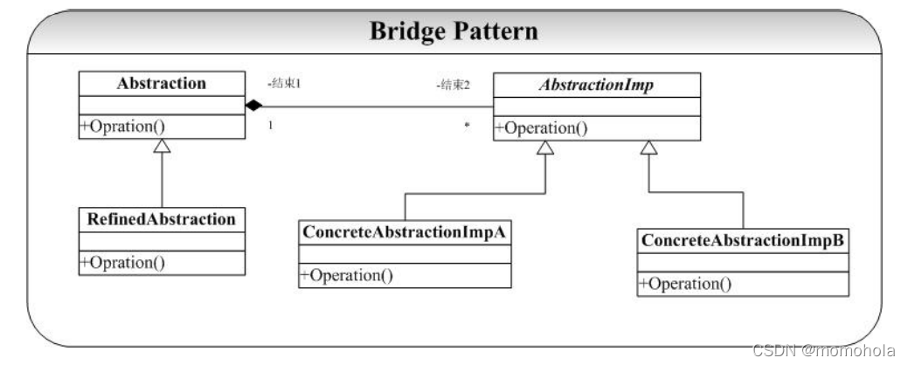

##### code

bridge.h

```cpp
#include <cstdio>
#include <iostream>

class AbstractionImp {
public:
    virtual void Operation_RunPythonInTerminal() = 0;
};

// ConcreteAbstractionImp
class ConcreteAbstractionImp_Python2 : public AbstractionImp {
public:
    void Operation_RunPythonInTerminal() {
        printf("start python2 \n");
    }
};

class ConcreteAbstractionImp_Python3 : public AbstractionImp {
public:
    void Operation_RunPythonInTerminal() {
        printf("start python3 \n");
    }
};

```

bridge.cpp

```cpp
#include "bridge_Imp.h"
// class AbstractionImp;

class Abstraction {
public:
    AbstractionImp* mImp = nullptr;
    virtual void Operation_RunPythonInTerminal() = 0;
};

class RefinedAbstraction_Windows : public Abstraction{
public:
    void Operation_RunPythonInTerminal() {
        printf("windows start WSL\n");
        if (mImp)
            mImp->Operation_RunPythonInTerminal();
    }
};

class RefinedAbstraction_Linux : public Abstraction{
public:
    void Operation_RunPythonInTerminal() {
        printf("linux start cmd\n");
        if (mImp)
            mImp->Operation_RunPythonInTerminal();
    }
};


int main() {
    Abstraction* mOS = new RefinedAbstraction_Windows;
    AbstractionImp* mPython = new ConcreteAbstractionImp_Python3;
    mOS->mImp = mPython;
    mOS->Operation_RunPythonInTerminal();
    free(mPython);
    mPython = new ConcreteAbstractionImp_Python2;
    mOS->mImp = mPython;
    mOS->Operation_RunPythonInTerminal();
    free(mPython);
    free(mOS);
    return 0;
}
```


#### Decorator 装饰器

##### 概念

单一职责，避免了子类的无限制膨胀，消除重复代码，兼具开闭选择。

- 特征

  - 子类继承基类

    多继承，多子类衍生 时的一个解决方法

  - 子类持有基类的指针。

    根据里氏替换，可以调用基类的同名方法，并在前后加上子类的操作。组合优于继承。

- 应用于 主体类多个方向上的扩展功能

  - 主体操作和扩展操作，应该分开分支继承。

  - 扩展操作通过持有的主体操作的指针，造成附加动作之后 调用主体操作。

##### OMT

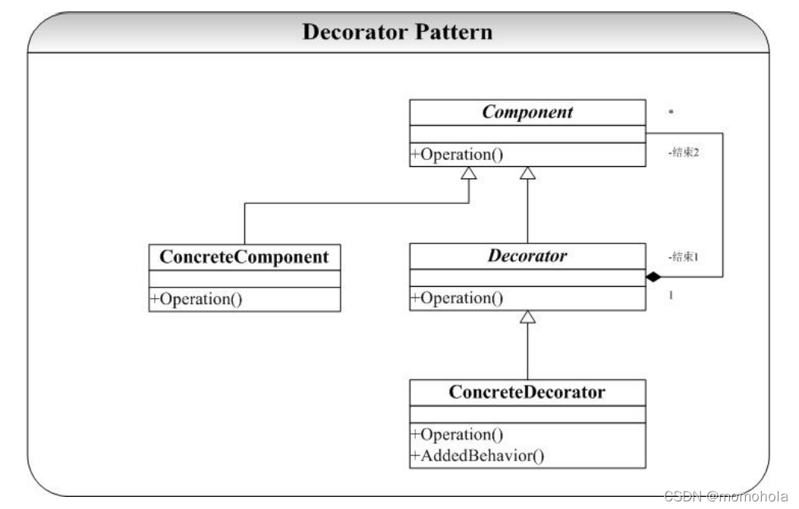


##### code

```cpp
#include <cstdio>
#include <iostream>
#include <iostream>
#include <string>

class DecoratorBase {
public:
    DecoratorBase* mImp = nullptr;
    virtual void Operation() = 0;
};

class ImpParty : public DecoratorBase {
public:
    std::string bro = "";
    ImpParty(std::string bro) {
        this->bro = bro;
    }
    void setBro(std::string name) {
        this->bro = name;
    }
    void Operation() {
        printf("Party start, hi %s\n", bro.c_str());
        if (mImp) {
            printf("lets drink!\n");
            mImp->Operation();
        }
    }
};

class ImpSoftDrink : public DecoratorBase {
public:
    std::string softdrink = "";
    ImpSoftDrink(std::string softdrink) {
        this->softdrink = softdrink;
    }
    void Operation() {
        printf("lets drink %s", softdrink.c_str());
    }
};

int main() {
    ImpParty* mParty = new ImpParty("John");
    ImpSoftDrink* mDrink = new ImpSoftDrink("cola");
    mParty->mImp = mDrink;
    mParty->Operation();
    delete mDrink;
    delete mParty;
    return 0;
}
```


### composite 组合模式

##### 概念

数据结构模式 之一

将对象组合成树状结构

树形结构不暴露给外界。

Compoment

树节点 composite 子类

- 持有 一个子类的链表
- add remove方法修改 其中的子类的链表

- process方法，执行子类链表中所有子类的process函数。直到叶子节点

叶子节点 leaf 没有链表，process函数执行功能。


##### OMT

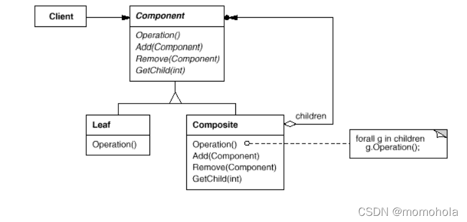


##### code

```cpp
```


### 其它人的代码

#### Adoptor 适配器模式

##### 概念

为了完成某项工作购买了一个第三方的库来加快开发。这就带来了一个问题：我们在应用程序中已经设计好了接口，与这个第三方提供的接口不一致，为了使得这些接口不兼容的类（不能在一起工作）可以在一起工作了，Adapter 模式提供了将一个类（第三方库）的接口转化希望的接口。

Itarget新实现的接口。adapter新实现。adaptee被适配的旧类

适配器模式分为类模式和对象模式。

- 常用做法。对象模式：对象适配器 adapter，

  - 持有adaptee，组合用于实现。

  - public继承Itarget 接口。


- 不常用做法。类模式：类适配器 adapter，

  - protect继承adaptee，用于实现。

  - public继承Itarget接口。(不灵活 继承的方案不灵活 类的多继承在cpp之外的语言压根就不支持)


##### OMT


- **采用继承原有接口类的方式**

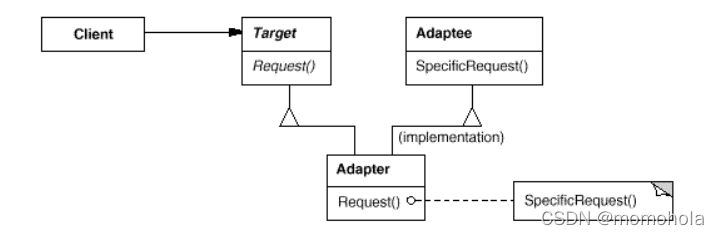

- **采用组合原有接口类的方式**

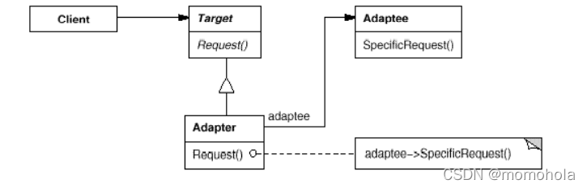

##### code

###### 继承

```cpp

#include <cstdio>
class Target_rob {
public:
    virtual int giveMeYrMoney() = 0;
};

class Adaptee_robInFrance {
public:
    int doRob() {
        printf("Levez les mains, donnez moi votre argent!\n");
        return 1000;
    }
};

class Adaptor_rob : public Target_rob, Adaptee_robInFrance {
public:
    int giveMeYrMoney() {
        return doRob();
    }
};

int main() {
    Target_rob* mClinet = dynamic_cast<Target_rob*>(new Adaptor_rob());
    int money = mClinet->giveMeYrMoney();
    printf("we got %d RMB!", money);
}

```


###### 组合

```cpp

#include <cstdio>
#include <cstdlib>
class Adaptee_rob {
public:
    virtual int doRob() = 0;
};
class Adaptee_robInFrance : public Adaptee_rob {
public:
    int doRob() {
        printf("Levez les mains, donnez moi votre argent!\n");
        return 1000;
    }
};

class Target_rob {
public:
    Adaptee_rob* mAdaptee = nullptr;
    virtual int giveMeYrMoney() = 0;
};

class Adaptor_rob : public Target_rob {
public:

    int giveMeYrMoney() {
        int money = 0;
        if (mAdaptee) {
            money = mAdaptee->doRob();
        } else {
            printf("we got nothing \n");
        }
        return money;
    }
};

int main() {
    Target_rob* mClinet = dynamic_cast<Target_rob*>(new Adaptor_rob());
    Adaptee_rob* mRobber = dynamic_cast<Adaptee_rob*>(new Adaptee_robInFrance());
    mClinet->mAdaptee = mRobber;
    int money = mClinet->giveMeYrMoney();
    printf("we got %d RMB!", money);
    return 0;
}
```


#### facade 门面模式

facad 门面模式 解欧系统见的交互

框架层面，没有具体的实例代码。对内 高内聚 对外应该松耦合。

封装内部可能高度复杂 高度耦合的盒子。例如安卓的vendor hal。数据访问相关sql等等。


### Flyweight 享元模式

内存池，每个字的字体，单例模式从容器中取出。

实现 右值引用 复制，clone原型模式

––– 接口隔离 –––


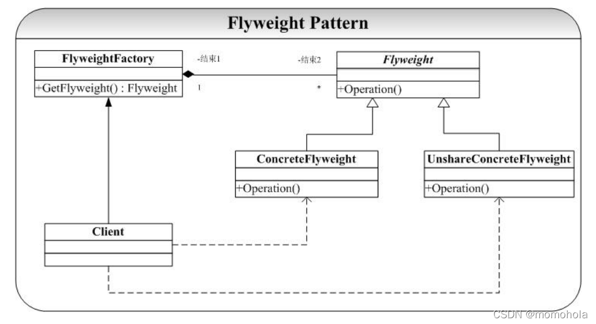


### Proxy 代理模式


在不失去透明操作对象的同时，控制管理这些对象内部特有的复杂性

对其他对象特供一种代理，以控制 (隔离 使用接口)对这个接口的访问。

- 对象创建开销大
- 某些操作需要安全控制
- 需要进程外的访问(分布式等)


## 行为模式

观察者模式，策略模式，命令模式，中介者模式，备忘录模式，模板方法模式，迭代器模式，状态模式，责任链模式，解释器模式，访问者模式


| 设计模式                     | 类型                                                         |
| ---------------------------- | ------------------------------------------------------------ |
| Template 模式                | 对算法中的某些步骤                                           |
| Strategy 模式                | 算法                                                         |
| State 模式                   | 对象的状态                                                   |
| Observer 模式                | 对多个对象依赖于另外一个对象，而这些对象又如何保持一致       |
| Memento 模式                 | 对一个对象中哪些私有信息存放在该对象之外，以及在对什么时候进行存储 |
| Mediator 模式                | 对象间怎样交互、和谁交互                                     |
| Command 模式                 | 何时、怎样满足一个请求                                       |
| Visitor 模式                 | 某些可作用于一个（组）对象上的操作，但不修改这些对象的类     |
| Chain of Responsibility 模式 | 满足一个请求的对象链                                         |
| Iterator 模式                | 如何遍历、访问一个聚合的各元素                               |
| Interpreter 模式             | 对一个语言的文法及解释                                       |


### Template 模板模式

对于某一个业务逻辑（算法实现）在不同的对象中有不同的细节实现，但是逻辑（算法）的框架（或通用的应用算法）是相同的。

Template 模式，采用继承的方式实现这一点

- 抽象基类：

  定义细节的接口，定义逻辑（算法）框架

- 子类

  实现逻辑细节。

  在子类实现详细的处理算法时并不会改变算法中的执行次序。


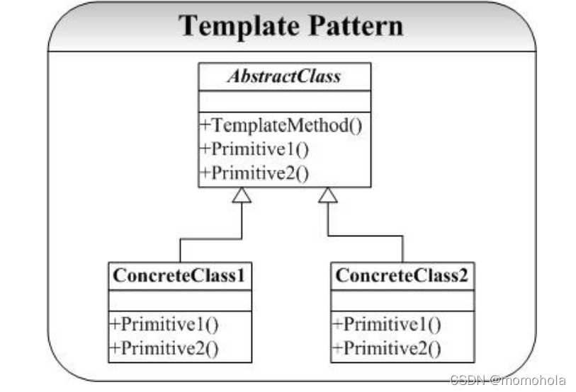

```cpp
#include <iostream>
using namespace std;

//做饮料模板
class TemplateDrink {
public:
    virtual ~TemplateDrink() = default;
    //煮水
    virtual void BoildWater() = 0;
    //冲泡
    virtual void Brew() = 0;
    //倒入杯中
    virtual void PourInCup() = 0;
    //加辅助材料
    virtual void AddSomething() = 0;

    //模板方法
    void Make() {
        BoildWater();
        Brew();
        PourInCup();
        AddSomething();
    }
};

class Coffee : public TemplateDrink {
    virtual void BoildWater() {
        cout << "煮纯净水" << endl;
    }
    virtual void Brew() {
        cout << "冲泡咖啡" << endl;
    }
    virtual void PourInCup() {
        cout << "咖啡倒入杯中" << endl;
    }
    virtual void AddSomething() {
        cout << "加牛奶" << endl;
    }
};


class Tea :public TemplateDrink {
    virtual void BoildWater() {
        cout << "煮山泉水" << endl;
    }
    virtual void Brew() {
        cout << "冲泡铁观音" << endl;
    }
    virtual void PourInCup() {
        cout << "茶水倒入杯中" << endl;
    }
    virtual void AddSomething() {
    }
};


int main()
{
    Tea* tea = new Tea;
    tea->Make();

    Coffee* coffee = new Coffee;
    coffee->Make();

    delete tea;
    delete coffee;
}
```


### Switch/Case

主要解决：Switch/Case 的爆炸

Switch/Case 的缺点

- 当状态数目很多的时候，维护一大组的Switch/Case 语句将是一件异常困难并且容易出错的事情。
- 状态逻辑和动作实现没有分离。

- 动作的实现代码直接写在状态的逻辑当中。

  后果是系统的扩展性和维护得不到保证。

#### State 状态模式

##### 概念

###### 和策略模式类似

每个人、事物在不同的状态下会有不同表现（动作），而一个状态又会在不同的表现下转移到下一个不同的状态（State）。

状态机

- 不同状态的operation，高度相似，相对固定。
- operation依据某个变量state，发生变化。

###### 优点

State类：枚举可能的状态，

- 可以方便地增加新的状态，只需要改变对象状态即可改变对象的行为。

- 封装了转换规则。在枚举状态之前需要确定状态种类。

Process：将所有与某个状态有关的行为放到一个类中，

- 允许状态转换逻辑与状态对象合成一体，而不是某一个巨大的条件语句块。

系统资源

- 通常与单例模式一起使用
- 可以让多个环境对象共享一个状态对象，从而减少系统中对象的个数。

###### 实现上

State

- State基类 除虚析构外，还持有
  - 一系列operation虚函数
  - 看情况
    - process指针（使用该指针，更改process中的下一个state）
    - state指针(指向下一个状态)，(上下文指针)

- State子类继承State基类
  - 重写operarion函数。

Process

- Process 基类
  - 持有State指针
  - 一系列operation虚函数。

- Process 子类

  - 重写operation

  - 调用State指针的operation

    让State更新为下一个状态 state = state->next。

##### code

```cpp
// main.cpp

#include <cstdio>
#include <cstdlib>
#include "processImpl.cpp"
#include "stateImpl.cpp"


int main() {

    Process* mProcess = new Process(10);
    mProcess->buy(101);
    mProcess->buy(1);
    mProcess->recharge(10);
    mProcess->buy(1);

    mProcess->recharge(1000);
    mProcess->buy(100);
    delete mProcess;

    return 1;
}
```


```cpp
// process.h

#include <cstdio>
#include <cstdlib>
#include "state.h"
#pragma once

class Process {
public:
    Process(int = 10);
    void set_state(State* state);
    void recharge(int money);
    void buy(int price);
    int query_money();
    int balance;
    State* mState = nullptr;
};

```


```cpp
// processImpl.cpp

#include "process.h"
#include "state.h"
#include <cstdio>
#pragma once

Process::Process(int init_money) {
    this->balance = init_money;
    if (init_money > 0) {
        this->set_state(new State_rich);
    } else {
        this->set_state(new State_poor);
    }
}

int Process::query_money() {
    return this->balance;
}

void Process::set_state(State* state) {
    if (mState)
        delete this->mState;
    this->mState = state;
    this->mState->set_process(this);
}

void Process::recharge(int money) {
    bool result = this->mState->recharge(money);
    this->balance += money;
    if (result) {
        printf("尊贵的用户: 充值后，余额 %d\n", this->query_money());
    } else {
        printf("欠费的用户: 充值后，余额 %d\n", this->query_money());
    }
}

void Process::buy(int price) {
    if (this->mState->buy(price))
        printf("购买成功， 余额 %d\n", this->query_money());
    else
        printf("购买失败 请充值， 余额 %d\n", this->query_money());
}
```


```cpp
// state.h
#include <cstdio>
#include <cstdlib>
#pragma once
class Process;

class State {
public:
    virtual ~State() = default;
    void set_process(Process* process) {
        this->process = process;
    }
    Process* get_process() {
        return this->process;
    }
	virtual bool buy(int) = 0; 
	virtual bool recharge(int) = 0; 
    Process* process;
};


class State_rich : public State {
public:
	bool buy(int) override;
	bool recharge(int) override;
};


class State_poor : public State {
public:
	bool buy(int) override;
	bool recharge(int) override;
};
```


```cpp
// stateImpl.cpp

#include <cstdio>
#include <cstdlib>
#include "state.h"
#include "process.h"
#pragma once

bool State_rich::buy(int price) {
	this->process->balance -= price;
	int balance = this->process->query_money();
	if (balance <= 0) {
		this->process->set_state(new State_poor);
	}
	return true;
}

bool State_rich::recharge(int money) {
	int balance = this->process->query_money();
	if (money + balance > 0) {
		return true;
	}
	return false;
}


bool State_poor::buy(int price) {
	// int balance = this->process->query_money();
	return false;
}

bool State_poor::recharge(int money) {
	int balance = this->process->query_money();
	if (money + balance > 0) {
		this->process->set_state(new State_rich);
		return true;
	}
	return false;
}
```


### 一对多/多对多

#### Observer 观察者模式(单向)

Observer 模式要解决的问题为：

指多个对象间存在一对多的依赖关系，当一个对象的状态发生改变 “一”变化的时候，所有依赖于这个“一”的多对象都得到通知并被自动更新。

Subject 提供

- 依赖于它的观察者 Observer 的
  - 注册（registerObserver）
  - 注销（remove）操作，

- 使依赖于它的所有观察者同步的操作（notifyObserver），

观察者 Observer 提供

- Update 操作
- 注意这里的 Observer 的 Update 操作并不在 Observer 改变了 Subject 目标状态的时候就对自己进行更新，这个更新操作要延迟到 Subject 对象发出 Notify 通知所有Observer 进行修改（调用 Update）。


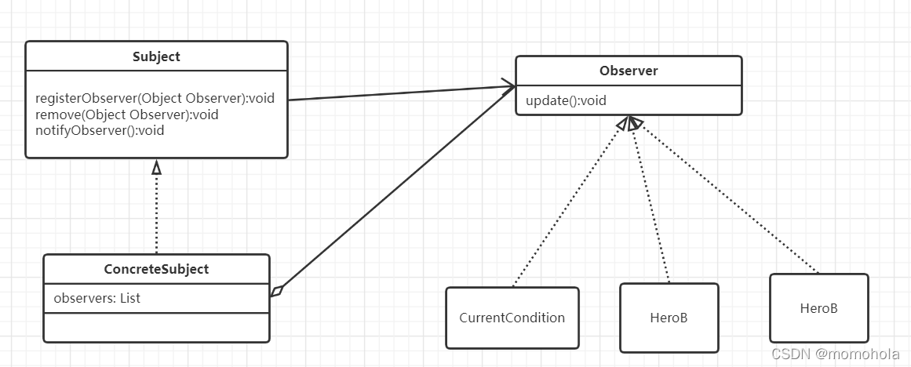


```cpp
#include <cstdio>
#include <iostream>
#include <string>
#include <list>

class Observer;
class Subscriber;

class Subject {
public:
    virtual ~Subject() = default;
    virtual void registObserver(Observer*) = 0;
    virtual void removeObserver(Observer*) = 0;
    virtual void notifyObserver() = 0;
    std::list<Observer*> mObservers;
};

class Subscriber {
public:
    Subscriber(std::string name) : name(name){};
    std::string name;
    void watchVideo() {
        printf("%s start watching . \n", this->name.c_str());
    }
};

class Observer {
public:
    void addSubscriber(Subscriber*);
    void removeSubscriber(Subscriber*);
    void notifySubscriber();
    std::list<Subscriber*> mSubcribers;
};

class Subject_Bilibili : public Subject {
public:
    virtual void registObserver(Observer* observer) {
        this->mObservers.push_back(observer);
    };
    virtual void removeObserver(Observer* observer) {
        this->mObservers.remove(observer);
    };
    virtual void notifyObserver() {
        printf("bilibili update! \n");
        for (auto observer : this->mObservers) {
            observer->notifySubscriber();
        }
    }
};

void Observer::addSubscriber(Subscriber* subscriber) {
    this->mSubcribers.push_back(subscriber);
}
void Observer::removeSubscriber(Subscriber* subscriber) {
    this->mSubcribers.remove(subscriber);
}
void Observer::notifySubscriber() {
    printf("好的，这就通知\n");
    for (auto subscriber : this->mSubcribers) {
        subscriber->watchVideo();
    }
}


int main() {
    Subject* biblibili = new Subject_Bilibili;
    Observer* mObserver = new Observer;
    Subscriber* A = new Subscriber("张三");
    Subscriber* B = new Subscriber("李四");
    Subscriber* C = new Subscriber("王五");

    biblibili->registObserver(mObserver);
    mObserver->addSubscriber(A);
    mObserver->addSubscriber(B);
    mObserver->addSubscriber(C);
    mObserver->removeSubscriber(C);

    biblibili->notifyObserver();


    return 1;
}
```


#### Mediator 中介模式(双向/多向)

Mediator 解耦系统内多个类之间需要大量密集复杂的相互交互，对他们进行集中管理。

- 依赖倒置原则 在多对象模型中的体现
- 类似交换机，要求 通信规范
- 实现
  - 让这些类继承相同的接口/成为某一基类的子类
  - 子类都持有中介的指针
  - 中介持有所有子类的指针


基类成员 基类::成员名，与子类成员进行区分。

```cpp
#include <cstdio>
#include <iostream>
#include <string>
#include <list>

class Mediator;

class Client {
public:
    virtual ~Client() = default;
    void registMediator(Mediator* mediator);
    void callSomeTeam(int type);
    virtual void responce() = 0;
    Mediator* mMediator;
    int type;
    std::string name;
};

class Client_Boss : public Client {
public:
    virtual ~Client_Boss() = default;
    Client_Boss(std::string name, Mediator* mediator) {
        Client::name = name;
        Client::type = 99;
        registMediator(mediator);
    }
    virtual void responce() {
        printf("Boss %s here! what do u want?\n", name.c_str());
    }
};

class Client_Engineer : public Client {
public:
    virtual ~Client_Engineer() = default;
    Client_Engineer(std::string name, Mediator* mediator) {
        Client::name = name;
        Client::type = 1;
        registMediator(mediator);
    }
    virtual void responce() {
        printf("Engineer %s here! how can i help u?\n", name.c_str());
    }
};

class Mediator {
public:
    void registClient(Client* client) {
        this->mClient.push_back(client);
    }
    void removeClient(Client* client) {
        this->mClient.remove(client);
    }
    void callClient(int type) {
        printf("callClient type = %d \n", type);
        for (auto client : this->mClient) {
            if (client->type == type) {
                client->responce();
            }
        }
    }
    std::list<Client*> mClient;
};


void Client::callSomeTeam(int type) {
    if (this->mMediator)
        this->mMediator->callClient(type);
    else
        printf("unset Mediator\n");
}

void Client::registMediator(Mediator* mediator){
    this->mMediator = mediator;
    mediator->registClient(this);
}


int main() {
    Mediator* mMediator = new Mediator;
    Client_Boss* mBoss = new Client_Boss("fajie", mMediator);
    Client_Engineer* mEngineer1 = new Client_Engineer("pengyi 1", mMediator);
    Client_Engineer* mEngineer2 = new Client_Engineer("pengyi 2", mMediator);

    mBoss->callSomeTeam(1);

    printf("10mins after\n");

    mEngineer1->callSomeTeam(99);

    return 1;
}
```


### 保存/封装 行为/请求

#### Strategy 策略模式

结构化设计 分而治之 

ifelse switch case中 if else绝对不变，可以用面相对象 抽象来解决。

##### OMT

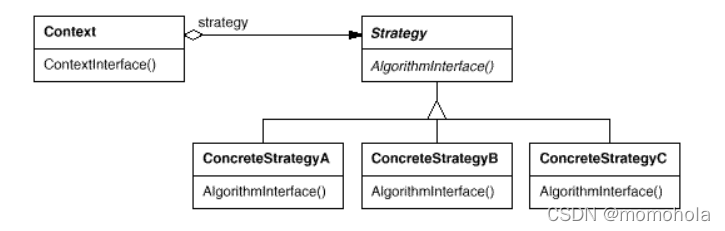


##### code

```cpp
#include <cstdio>
#include <cstdlib>

class Strategy {
public:
    virtual ~Strategy() = default;
    virtual void excute() = 0;
};

class Strategy_allin : public Strategy {
public:
    void excute() {
        printf("塔塔开!\n");
    }
};

class Strategy_giveup : public Strategy {
public:
    void excute() {
        printf("点了点了点了.\n");
    }
};

class ChasingGame {
public:
    void play() {
        if (this->mStrategy) {
            mStrategy->excute();
        } else {
            printf("挂机，等着输.\n");
        }
    }
    void set_strategy(Strategy* strategy) {
        if (this->mStrategy) {
            delete this->mStrategy;
        }
        this->mStrategy = strategy;
    }
    Strategy* mStrategy = nullptr;
};

int main() {
    ChasingGame* mGame = new ChasingGame;
    mGame->play();
    Strategy* mStrategy = new Strategy_allin;
    mGame->set_strategy(mStrategy);
    mGame->play();
    mStrategy = new Strategy_giveup;
    mGame->set_strategy(mStrategy);
    mGame->play();
    return 1;
}

```


#### command 命令模式(保存)

将 请求/行为 封装成对象。

基类 Command 虚方法 excute，子类继承后实现excute方法。到此为止的话 和策略模式特别类似，但区别是 存在一个容器(复合命令对象)存放cmd对象，执行其中所有的命令。

- 策略模式，往往需要工厂模式创建一个对象 执行该对象的方法。


- cmd模式，一般自行创建cmd对象，将请求放入队列中。怎么执行这个请求，是队列决定的

函数对象和cmd模式存在相似。

- 函数对象

  - 执行函数对象是通过重载()操作符，

  - 函数对象以函数签名来定义行为接口规范，

  - 编译时绑定(泛型编程 使用模板，编译时解析类型) 

    更灵活，性能更高。

- cmd模式

  - 以面相对象的 “接口 实现”来定义行为接口规范，更严格
  - 有性能损失
  - 运行时绑定 > 编译时绑定


```cpp
#include <cstdio>
#include <cstdlib>
#include <vector>

class Command {
public:
    virtual ~Command() = default;
    virtual void excute() = 0; 
};

class Command_EatApple : public Command {
public:
    void excute() {
        printf("eat an Apple\n");
    }
};

class Command_DrinkTea : public Command {
public:
    void excute() {
        printf("drink a cup of tea\n");
    }
};

class CmdQueue {
public:
    void enqueueCmd(Command* cmd) {
        this->cmds.push_back(cmd);
    }
    void handleCmd() {
        for (auto cmd : this->cmds) {
            cmd->excute();
        }
        cmds.clear();
    }
    std::vector<Command*> cmds;
};

int main() {
    CmdQueue* mQueue = new CmdQueue;
    Command_DrinkTea* cmd1 = new Command_DrinkTea;
    Command_EatApple* cmd2 = new Command_EatApple;
    mQueue->enqueueCmd(cmd1);
    mQueue->enqueueCmd(cmd2);

    printf("容器决定什么时候执行cmd");
    mQueue->handleCmd();
    delete cmd1;
    delete cmd2;
    delete mQueue;
    return 0;
}

```


#### visitor 访问者模式(升维)

##### 概念

对 Strategy模式 的维度提升——

原先，Strategy ：

- 实现处 基类定义 子类实现，一个方法 `excute`。
- 使用处 调用。

后来，Command：

- 实现处 基类定义 子类实现，一个方法 `excute`。
- 使用处将 Strategy 视为一个可移动的对象，决定什么时候执行/不执行 其中的 `excute`  方法。

**现在，visitor ：**作用与对象结构的二次辨析（dispatch）

- 实现处 visitor 类

  - 基类：要求各个方法的接口足够稳定
    - 定义若干虚函数 `actionA, actionB ...`
  - 子类：visitor的子类是变化的
    - 实现虚函数 `actionA, actionB ...`

- 使用处 element类：

  层次结构稳定，其中面临的操作面临频繁的变化。

  - 基类 element：基类稳定

    - 一个接口 `action`，不同的子类对其进行实现

      基类element中添加新的虚函数，就不再需要修改子类了。

    - 方法accept(＆visitor)

      保存 visitor 对象（而不用保存若干不同的 Strategy/Command 对象—— all in one）

  - 子类：要求数量稳定

    - 实现接口 `action`
    - 实现的方法是：调用 所保存的 visitor 对象的不同 `actionX`。例如 
      - elementA 的方法action执行visitor.actionA
      - elementB的方法action执行visitor.actionB


##### code

```cpp
// 作用与对象结构的二次辨析
#include <cstdio>


class Visitor {
public:
    virtual ~Visitor() = default;
    virtual void action_lunch() = 0;
    virtual void action_dinner() = 0;
};


class Visitor_Shanghai : public Visitor {
public:
    virtual void action_lunch() {
        printf("山西午餐吃炸酱面\n");
    }
    virtual void action_dinner() {
        printf("山西晚餐吃刀削面\n");
    }
};

class Visitor_ShanXi : public Visitor {
public:
    virtual void action_lunch() {
        printf("上海午餐吃酱鸭子\n");
    }
    virtual void action_dinner() {
        printf("上海晚餐吃剩下的酱鸭子\n");
    }
};

class Element {
public:
    virtual ~Element() = default;
    virtual void eat_meal() = 0;
    virtual void accept(Visitor* visitor) {
        mVisitor = visitor;
    }
    Visitor* mVisitor;
};

class Element_Lunch : public Element {
public:
    virtual void eat_meal() {
        if (mVisitor) {
            mVisitor->action_lunch();
        }
    }
};

class Element_dinner : public Element {
public:
    virtual void eat_meal() {
        if (mVisitor) {
            mVisitor->action_dinner();
        }
    }
};


int main() {
    Visitor* mShanxi = new Visitor_ShanXi;
    Visitor* mShanghai = new Visitor_Shanghai;
    Element* meal = new Element_Lunch;
    meal->accept(mShanghai);
    meal->eat_meal();
    delete meal;
    meal = new Element_dinner;
    meal->accept(mShanxi);
    meal->eat_meal();
    delete meal;
    delete mShanghai;
    delete mShanxi;

    return 1;
}
```


### 过时

#### Memento 备忘录模式

信息隐藏条件下，对对象的快照。

原发器，持有state，保存快照时 根据state创建并返回一个memnto对象。恢复时，传入memnto对象，设置 原发器的state对象。 实现对原发器对外的信息隐藏。

小模式 现在来看太低级了 java c#等具有高效成熟容易正确实现的对象序列化支持，有更容易正确实现的序列化方案。


#### 迭代器

从性能角度讲——编译期多态好过运行时多态

- 泛型编程的迭代器 > 面相对象的迭代器

- 虚函数成本过高

但在 java c# php等等语言，不支持编译时多态，仍然在使用运行时多态 


#### 责任链模式

运行时的类型判断。一个请求者可能有多个接受者，但最后真正的接受者或者说处理者只有一个。运行时动态添加 修改请求的处理职责。

避免请求的发送者和接受者之间的耦合关系。

数据结构构成的处理模型。链表


行为变化，将组件的行为与组件本身进行解耦

非虚函数，静态函数 地址在编译时绑定的方式。

虚函数是运行时，使用虚函数表指针绑定的。


#### Interpreter 模式

对一个语言的文法及解释


